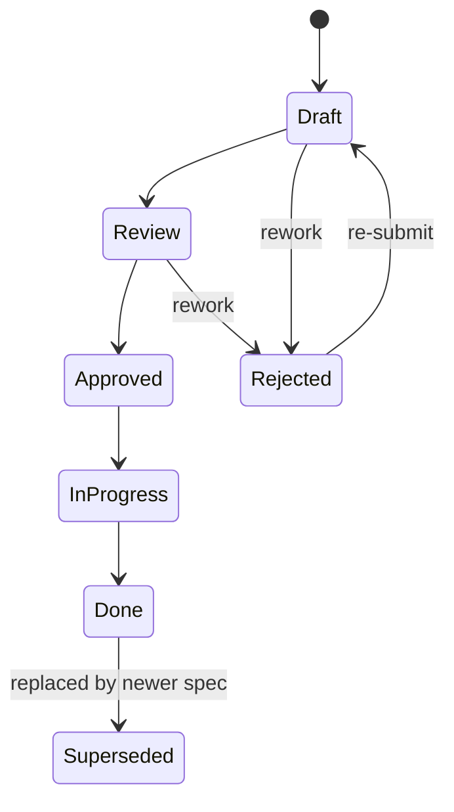

# 000 — Base Spec: Feature Specification Standard

> This document defines the standard format, workflow, and conventions for all
> feature specifications in the Ownit project. Every numbered spec (`001_`, `002_`, etc.)
> should follow this template.

---

## Purpose

Specs are the **single source of truth** for what a feature does, why it exists,
and how it should be built. They serve two audiences:

| Audience | What they get |
|----------|---------------|
| **Humans** | Clear requirements, scope boundaries, and design rationale to review and approve |
| **AI Agents** | Unambiguous, structured instructions to implement features correctly without guesswork |

A spec is **not** a tutorial or a code walkthrough. It is a contract: once approved,
it becomes the authoritative reference for implementation.

---

## Spec Lifecycle



| Status | Meaning |
|--------|---------|
| **Draft** | Being written. Not ready for review. |
| **Review** | Ready for human review. Open questions must be resolved before approval. |
| **Approved** | Accepted as-is. Implementation can begin. |
| **In Progress** | Actively being implemented. |
| **Done** | Fully implemented, tested, and merged. |
| **Rejected** | Did not pass review. Needs rework or is abandoned. |
| **Superseded** | Replaced by a newer spec (link to successor). |

---

## File Naming Convention

```
docs/specs/NNN_short_description.md
```

- `NNN` — Zero-padded, monotonically increasing number (`001`, `002`, …).
- `short_description` — Snake_case, concise name (e.g., `study_planner`, `pomodoro_timer`).
- `000_base_spec.md` is reserved for this document.

---

## Spec Template

Below is the canonical template. Copy it for each new spec. Sections marked
**(optional)** can be omitted if truly not applicable.

---

````markdown
# NNN — Feature Name

> One-line summary of what this feature does and why it matters.

## Meta

| Field           | Value                          |
|-----------------|--------------------------------|
| **Status**      | Draft / Review / Approved / In Progress / Done |
| **Author**      | Name or handle                 |
| **Created**     | YYYY-MM-DD                     |
| **Updated**     | YYYY-MM-DD                     |
| **Depends on**  | #NNN (link to prerequisite specs) |
| **Supersedes**  | #NNN (if replacing an older spec) |

---

## Problem Statement

Describe the problem this feature solves. Include:
- Who is affected (user persona or system component).
- What pain point or gap exists today.
- Why solving this matters for the project's goals.

Keep it short — 3–5 sentences is usually enough.

---

## Goals & Non-Goals

### Goals
- [ ] What this feature WILL accomplish (use checkboxes for trackability).

### Non-Goals
- What this feature will explicitly NOT do (prevents scope creep).

---

## Proposed Solution

### Overview
High-level description of the approach. Diagrams encouraged (Mermaid supported).

### User Experience
How the user interacts with this feature. Include:
- Key user flows (step-by-step).
- UI wireframes or mockup descriptions.
- Edge cases and error states.

### Data Model
Database tables, fields, relationships. Use the project's SQLAlchemy Core convention.

```python
# Example table definition
table_name = Table(
    'table_name',
    metadata,
    Column('id', UUID, primary_key=True, server_default=func.gen_random_uuid()),
    # ... columns
    *timestamp_columns(),
)
```

### API Endpoints
Define each endpoint with method, path, request/response schemas, and auth requirements.

| Method | Path | Auth | Description |
|--------|------|------|-------------|
| `GET`  | `/resource` | Yes | List resources |
| `POST` | `/resource` | Yes | Create resource |

Request/response bodies should reference Pydantic schema names.

### Frontend Components
List the key components, their responsibilities, and where they live.

| Component | Path | Description |
|-----------|------|-------------|
| `ResourceList` | `features/resource/components/ResourceList.tsx` | Displays paginated list |

### Business Rules
Enumerate the core logic rules, validations, and constraints:
1. Rule description.
2. Another rule.

---

## Implementation Plan

### Backend
Ordered list of implementation steps for the API:
1. Step with file path and what to create/modify.

### Frontend
Ordered list of implementation steps for the UI:
1. Step with file path and what to create/modify.

### Migrations
List any database migrations required:
1. Migration description and command.

---

## Testing Strategy

### Backend Tests
- What to test and how (unit, integration).
- Key test scenarios.

### Frontend Tests (optional)
- Component tests, if applicable.

### Manual Verification
- Steps to manually verify the feature works end-to-end.

---

## Open Questions

> Items that need human input or decision before implementation can proceed.
> Remove this section once all questions are resolved.

- [ ] Question 1?
- [ ] Question 2?

---

## Decision Log (optional)

Record important decisions made during the spec's lifecycle.

| Date | Decision | Rationale |
|------|----------|-----------|
| YYYY-MM-DD | Chose approach A over B | Because X, Y, Z |

---

## References (optional)

- Links to external resources, research, or related specs.
````

---

## Conventions for Writing Specs

### For Humans

1. **Be specific about scope.** Vague specs lead to rework. If something is out
   of scope, say so explicitly in Non-Goals.
2. **Resolve open questions before approving.** A spec with unresolved questions
   should stay in Review status.
3. **Keep it updated.** If requirements change during implementation, update the
   spec and bump the `Updated` date.
4. **One feature per spec.** If a feature grows too large, split it into
   multiple specs with dependency links.

### For AI Agents

1. **Follow the spec literally.** If the spec says "use X approach," use X.
   Don't innovate unless the spec says "agent's choice."
2. **Reference the spec in commits.** Mention the spec number in PR descriptions
   and commit messages (e.g., `feat(goal): implement goal CRUD [spec #001]`).
3. **Flag ambiguities.** If the spec is unclear, ask the human rather than guessing.
   Use the Open Questions section to document what needs clarification.
4. **Don't exceed scope.** Implement what's in the spec. If you see an improvement
   opportunity, note it as a suggestion — don't implement it unilaterally.
5. **Follow existing patterns.** Always check `AGENTS.md` for project conventions
   before writing code. The spec defines *what* to build; `AGENTS.md` defines *how*.

### Interaction Protocol

When an AI agent receives a spec to implement:

```
1. Read the spec completely.
2. Read AGENTS.md for project conventions.
3. Identify any ambiguities or blockers → raise them as Open Questions.
4. If clear, create an implementation plan artifact and request human approval.
5. On approval, execute the plan, tracking progress in a task artifact.
6. On completion, update the spec status to Done.
```

---

## Changelog

| Date | Change |
|------|--------|
| 2026-06-01 | Initial version — base spec template created. |
