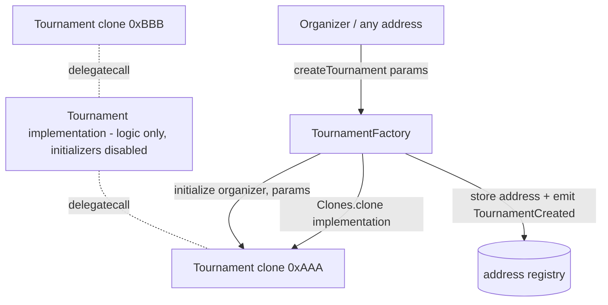

# 001 — Tournament Factory & Creation

> A factory smart contract that creates isolated, per-tournament contract
> instances (via minimal-proxy clones) and maintains a discoverable registry of
> every tournament ever created. Scope is **creation and retrieval only** —
> registration, results, prizes, and judging land in later specs.

## Meta

| Field          | Value                                  |
|----------------|----------------------------------------|
| **Status**     | Approved                               |
| **Author**     | Ricardo Vinicius                       |
| **Created**    | 2026-06-30                             |
| **Updated**    | 2026-06-30                             |
| **Depends on** | —                                      |
| **Supersedes** | —                                      |

---

## Problem Statement

Arbiter is a decentralized tournament platform, but today the `packages/contracts`
package contains only the scaffold `Counter` contract — there is no on-chain way
to create a tournament or to discover which tournaments exist. Organizers need a
trustless entry point to spin up a tournament with fixed, verifiable parameters
(format, capacity, entry fee, schedule, judges), and the rest of the platform
(web app, indexers) needs a single authoritative place to enumerate tournaments
and read their configuration. This spec delivers that foundation; the heavier
per-tournament logic (registration, round tracking, judge voting, prize
distribution) is intentionally deferred so the creation layer can be reviewed,
audited, and shipped on its own.

---

## Goals & Non-Goals

### Goals
- [ ] A `TournamentFactory` contract that deploys a new `Tournament` instance per
      tournament using EIP-1167 minimal-proxy **clones** of a single deployed
      implementation.
- [ ] Permissionless creation: any address may call `createTournament`, and the
      caller (`msg.sender`) becomes that tournament's **organizer**.
- [ ] Each `Tournament` clone stores its immutable-after-init configuration:
      format, max players, entry fee (wei), start/end dates, judges, organizer.
- [ ] The factory maintains an enumerable registry of all created tournaments
      (count + indexed access + paginated listing + lookup by organizer).
- [ ] Events for tournament creation to enable off-chain tracking/indexing.
- [ ] Input validation with descriptive custom errors (capacity, schedule,
      judge addresses).
- [ ] Published, auto-generated ABIs (`tournamentFactoryAbi`, `tournamentAbi`)
      and an Ignition deployment module.
- [ ] Solidity unit tests (`*.t.sol`) and a viem TypeScript integration test.

### Non-Goals
- **Participant registration** (`register()`), participant tracking, and entry-fee
  *collection*. The `entryFee` is stored now but never charged in this task — a
  follow-up spec consumes it.
- **ERC20 entry fees.** Entry fee is denominated in native ETH (wei) only;
  ERC20 support is a documented future extension.
- Results/scoring, round/bracket progression, judge voting, prize distribution,
  refunds, cancellation, and tournament state transitions.
- Upgradeability of the implementation (no UUPS/transparent proxy; clones point
  at one fixed implementation per factory deployment).
- Any frontend / web-app work. This spec is contracts-only.

---

## Proposed Solution

### Overview

A factory-of-clones architecture. One `Tournament` implementation contract is
deployed once and holds only logic. `TournamentFactory` holds the implementation
address and, on each `createTournament`, deploys a cheap EIP-1167 proxy
(`Clones.clone`) that delegates to that implementation but owns its **own storage
and ETH balance**. The clone cannot use a constructor, so configuration happens
through an `initialize(...)` function guarded by OpenZeppelin's `initializer`
modifier (callable exactly once).



Why clones: per-tournament isolation (each tournament's future prize pool is a
physically separate balance) at a fraction of the deploy cost of redeploying full
bytecode each time. See the Decision Log for the architecture choice.

### Dependencies

Add **`@openzeppelin/contracts@^5.6.1`** to `packages/contracts` (`pnpm --filter
@arbiter/contracts add @openzeppelin/contracts`). OZ v5 ships both required
modules in this single package:

- `@openzeppelin/contracts/proxy/Clones.sol` — `Clones.clone(address)`.
- `@openzeppelin/contracts/proxy/utils/Initializable.sol` — `Initializable`
  base, `initializer` modifier, `_disableInitializers()`.

OZ v5 requires `pragma solidity ^0.8.20`; the project's `0.8.28` satisfies it.

> Access control: this task has **no organizer-only functions yet**, so the
> organizer is stored as a plain `address` rather than pulling in
> `OwnableUpgradeable`. Ownable/admin wiring is deferred to the spec that adds
> mutating tournament logic. `ReentrancyGuard` is likewise deferred — there are
> no value transfers or untrusted external calls in the creation path.

### Contract Interfaces

Shared types (declared once, e.g. in `Tournament.sol` and imported by the factory):

```solidity
enum TournamentFormat {
    SingleElimination // index 0; only supported format for now
}

struct TournamentParams {
    TournamentFormat format;
    uint32  maxPlayers;   // bracket capacity; must be >= 2
    uint256 entryFee;     // wei; 0 allowed (free tournament). NOT collected this task.
    uint64  startDate;    // unix seconds; must be in the future
    uint64  endDate;      // unix seconds; must be > startDate
    address[] judges;     // stored for later judging logic; may be empty
}
```

#### `Tournament` (implementation, cloned)

```solidity
contract Tournament is Initializable {
    address public organizer;
    TournamentFormat public format;
    uint32  public maxPlayers;
    uint256 public entryFee;
    uint64  public startDate;
    uint64  public endDate;
    address[] private _judges;

    /// @dev Locks the implementation so it can never be initialized directly;
    ///      only clones (which start uninitialized) may call initialize().
    constructor() { _disableInitializers(); }

    /// @notice One-time configuration of a freshly cloned tournament.
    /// @dev Called by the factory immediately after cloning. `initializer`
    ///      reverts on any second call.
    function initialize(address organizer_, TournamentParams calldata params)
        external
        initializer;

    /// @notice Full judge list (the public mapping-style getter only returns one element).
    function getJudges() external view returns (address[] memory);

    /// @notice All configuration in a single call, for cheap off-chain reads.
    function details() external view returns (
        address organizer_,
        TournamentFormat format_,
        uint32 maxPlayers_,
        uint256 entryFee_,
        uint64 startDate_,
        uint64 endDate_,
        address[] memory judges_
    );
}
```

#### `TournamentFactory`

```solidity
contract TournamentFactory {
    address public immutable implementation;        // the Tournament logic contract
    address[] private _tournaments;                 // every clone, in creation order
    mapping(address => address[]) private _byOrganizer;

    constructor(address implementation_);           // reverts if implementation_ == address(0)

    /// @notice Deploy and initialize a new tournament; caller becomes organizer.
    /// @return tournament The address of the newly created clone.
    function createTournament(TournamentParams calldata params)
        external
        returns (address tournament);

    function tournamentCount() external view returns (uint256);
    function tournamentAt(uint256 index) external view returns (address);

    /// @notice Paginated slice of the registry (offset/limit) to avoid unbounded returns.
    function getTournaments(uint256 offset, uint256 limit)
        external
        view
        returns (address[] memory);

    function tournamentsOf(address organizer) external view returns (address[] memory);
}
```

### Events

| Contract | Event | Signature | Purpose |
|----------|-------|-----------|---------|
| `TournamentFactory` | `TournamentCreated` | `TournamentCreated(address indexed tournament, address indexed organizer, uint256 indexed index)` | Canonical off-chain signal for indexers/web app. |
| `Tournament` | `TournamentInitialized` | `TournamentInitialized(address indexed organizer, TournamentFormat format, uint32 maxPlayers, uint256 entryFee, uint64 startDate, uint64 endDate)` | Emitted from `initialize`; lets a clone's own logs carry its config. Judges omitted (kept out of indexed/log args to bound cost; read via `getJudges()`). |

### Errors (custom errors, not require-strings)

Per AGENTS.md, exception messages must include the offending value and expected
shape. Declared and reverted with the offending value:

```solidity
error ZeroImplementation();                         // factory constructor
error InvalidMaxPlayers(uint32 provided);           // require maxPlayers >= 2
error MaxPlayersNotPowerOfTwo(uint32 provided);     // single-elimination bracket must be 2,4,8,...
error StartDateInPast(uint64 startDate, uint64 nowTs);
error InvalidDateRange(uint64 startDate, uint64 endDate); // require endDate > startDate
error ZeroJudgeAddress(uint256 index);              // a judges[i] == address(0)
error IndexOutOfBounds(uint256 index, uint256 length); // tournamentAt
```

### Business Rules

1. **Permissionless creation.** Any address may call `createTournament`; no
   allowlist or owner gate.
2. **Organizer = caller.** The clone's `organizer` is set to the factory's
   `msg.sender`, not to a parameter (prevents spoofing).
3. **Capacity.** `maxPlayers >= 2`, else revert `InvalidMaxPlayers`. For
   single-elimination it must additionally be a **power of two** (2, 4, 8, 16, …)
   so the bracket has no byes — checked as `maxPlayers & (maxPlayers - 1) == 0`,
   else revert `MaxPlayersNotPowerOfTwo`.
4. **Schedule.** `startDate > block.timestamp` (revert `StartDateInPast`) and
   `endDate > startDate` (revert `InvalidDateRange`).
5. **Judges.** May be empty. No judge entry may be the zero address (revert
   `ZeroJudgeAddress`). Duplicate-judge rejection is an Open Question; not
   enforced now.
6. **Entry fee.** Any `uint256` including `0` is valid. Stored only; never
   transferred or collected in this task. Denominated in wei (native ETH).
7. **Format.** Only `SingleElimination` exists in the enum; no extra runtime
   check is needed until a second format is added.
8. **Initialization is single-shot.** `initialize` is guarded by `initializer`;
   a second call reverts. The implementation itself is permanently locked via
   `_disableInitializers()` in its constructor.
9. **Registry ordering.** `_tournaments` is append-only in creation order; an
   index, once assigned, never changes. `getTournaments` clamps `limit` to the
   available tail past `offset` and returns an empty array if `offset >= count`.

---

## Implementation Plan

### Contracts
1. `pnpm --filter @arbiter/contracts add @openzeppelin/contracts` (pin `^5.6.1`).
2. Create `packages/contracts/contracts/Tournament.sol`:
   - Declare `TournamentFormat`, `TournamentParams`, custom errors,
     `TournamentInitialized` event.
   - `is Initializable`; constructor calls `_disableInitializers()`.
   - Implement `initialize` with all validations from Business Rules; copy
     `judges` into storage with a per-element zero-address check; emit
     `TournamentInitialized`.
   - Implement `getJudges()` and `details()`.
3. Create `packages/contracts/contracts/TournamentFactory.sol`:
   - Import `Clones` and the `Tournament` types.
   - Constructor stores `implementation` (revert `ZeroImplementation` on zero).
   - `createTournament`: `Clones.clone(implementation)` → `Tournament(clone).initialize(msg.sender, params)` → push to `_tournaments` and `_byOrganizer[msg.sender]` → emit `TournamentCreated` → return address.
   - Implement `tournamentCount`, `tournamentAt` (bounds-checked),
     `getTournaments(offset, limit)`, `tournamentsOf`.
4. Keep both files under 500 lines and functions 4–20 lines (split helpers like
   `_validate(params)` if `initialize` grows).

### Tooling / publishing
5. Update `packages/contracts/scripts/generate-abi.mjs`: add
   `{ name: "Tournament", exportName: "tournamentAbi" }` and
   `{ name: "TournamentFactory", exportName: "tournamentFactoryAbi" }` to the
   `contracts` array.
6. Re-export both ABIs from `packages/contracts/src/index.ts`.
7. Add `packages/contracts/ignition/modules/TournamentFactory.ts`: deploy
   `Tournament` (implementation) first, then `TournamentFactory` with the
   implementation address.

### Build verification
8. Run `pnpm --filter @arbiter/contracts build` (compiles, then regenerates
   `src/generated/abi.ts`) and `pnpm --filter @arbiter/contracts typecheck`.

---

## Testing Strategy

### Solidity unit tests — `contracts/Tournament.t.sol`, `contracts/TournamentFactory.t.sol`
Use `forge-std/Test.sol` (see `Counter.t.sol` for the pattern), `vm.warp` to
control `block.timestamp`, `vm.expectRevert` with the typed custom error.

- `initialize` happy path: every field stored correctly; `getJudges()` returns
  the full array; `TournamentInitialized` emitted.
- Reverts: `maxPlayers` of 0 and 1 → `InvalidMaxPlayers`; a non-power-of-two
  `maxPlayers` (e.g. 3, 6, 10) → `MaxPlayersNotPowerOfTwo`; `startDate <= now` →
  `StartDateInPast`; `endDate <= startDate` → `InvalidDateRange`; a zero judge
  address → `ZeroJudgeAddress`. Powers of two (2, 4, 8) succeed.
- `entryFee == 0` and empty `judges` both succeed.
- Calling `initialize` twice reverts (single-shot).
- The implementation contract reverts when `initialize` is called on it directly
  (constructor `_disableInitializers`).
- Factory: zero implementation address in constructor → `ZeroImplementation`;
  `tournamentAt` out of range → `IndexOutOfBounds`.

### TypeScript integration test — `test/TournamentFactory.ts`
Use `network.create()` + `viem` (see `test/Counter.ts`):
- Deploy implementation + factory; `createTournament` emits `TournamentCreated`
  with the right `organizer`/`index` (assert via `viem.assertions.emitWithArgs`).
- The returned clone address is a real contract; `details()` matches the input.
- **Isolation:** create two tournaments from two different accounts; assert
  distinct addresses, distinct organizers, and that reading one doesn't reflect
  the other's config.
- Registry: `tournamentCount`, `tournamentAt`, `getTournaments` pagination
  (offset/limit at boundaries, `offset >= count` → empty), `tournamentsOf`.

### Manual verification
- `pnpm --filter @arbiter/contracts build` succeeds and writes both ABIs into
  `src/generated/abi.ts`.
- `pnpm --filter @arbiter/contracts test` is green.
- Optionally dry-run the Ignition module against a `hardhat` simulated network.

---

## Decision Log

| Date | Decision | Rationale |
|------|----------|-----------|
| 2026-06-30 | **Architecture: factory + EIP-1167 minimal-proxy clones** (over a full contract-per-tournament deploy, or a single struct registry) | Per-tournament storage/ETH isolation that the later prize/rule-engine logic needs, at far lower per-creation gas than redeploying full bytecode. Single registry was rejected because commingled funds + a god-contract approaching the 24KB limit fights the upcoming logic task. |
| 2026-06-30 | **Entry fee in native ETH (wei) now; ERC20 deferred** | Keeps the MVP small; ERC20 adds approvals + reentrancy surface better handled with the registration spec that actually moves funds. |
| 2026-06-30 | **Permissionless creation; organizer = `msg.sender`** | Matches Arbiter's decentralized framing; spoofing prevented by deriving organizer from the caller rather than a parameter. |
| 2026-06-30 | **Registration & participant tracking deferred** | This task ships creation + retrieval only so it can be reviewed/audited independently; `entryFee` is stored but not collected. |
| 2026-06-30 | **Use OpenZeppelin `Clones` + `Initializable`; defer `Ownable`/`ReentrancyGuard`** | Battle-tested clone + init pattern (avoids hand-rolling initializer footguns); no admin functions or value transfers exist yet, so the heavier access/reentrancy primitives aren't needed until later. |
| 2026-06-30 | **Enforce `maxPlayers` is a power of two for single-elimination** | A single-elimination bracket with a non-power-of-two size requires byes; restricting to 2/4/8/… keeps bracket generation in the later logic spec clean and unambiguous. |
| 2026-06-30 | **Allow duplicate judge addresses; leave judge count unbounded** | Dedup/cap add gas and complexity for little benefit at the creation stage; can be revisited when judging logic lands. |
| 2026-06-30 | **No bound on schedule span; implementation address stays publicly exposed** | Schedule length is organizer discretion; the `public immutable implementation` getter is harmless and useful for verification/indexing. |

---

## References

- Base spec template — `docs/specs/000_base_spec.md`
- Original draft requirements — prior contents of this file (superseded by this spec)
- EIP-1167 Minimal Proxy — https://eips.ethereum.org/EIPS/eip-1167
- OpenZeppelin `Clones` — https://docs.openzeppelin.com/contracts/5.x/api/proxy#Clones
- OpenZeppelin `Initializable` — https://docs.openzeppelin.com/contracts/5.x/api/proxy#Initializable
- Project conventions — `AGENTS.md`, `packages/contracts/AGENTS.md`
