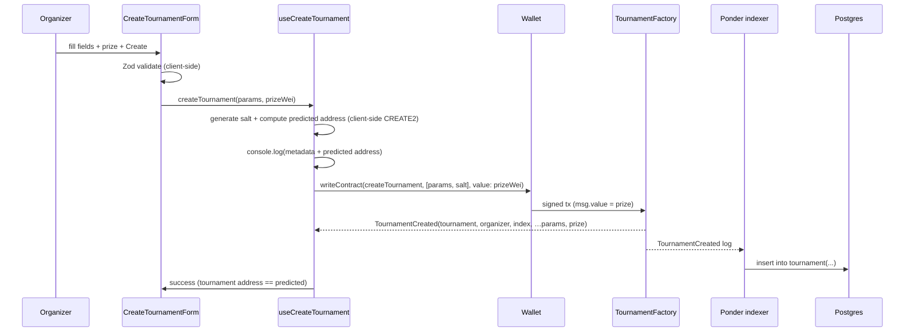

# 002 — Create Tournament Wizard

> A wallet-signed, 5-step wizard that creates a tournament on-chain (with a prize
> deposit) via `TournamentFactory.createTournament`, indexed into Postgres by Ponder.

## Meta

| Field          | Value |
|----------------|-------|
| **Status**     | Draft |
| **Author**     | Ricardo Vinicius |
| **Created**    | 2026-07-01 |
| **Updated**    | 2026-07-02 |
| **Depends on** | `TournamentFactory` / `Tournament` contracts (commit `81f7d63`) + the contract change below |

---

## Problem Statement

The app has no way to create a tournament. The `TournamentFactory` /
`Tournament` contracts expose a permissionless `createTournament`, but nothing
calls it and there is no read path — created tournaments are invisible until
indexed. This spec delivers the path from "connected wallet" to "tournament
created on-chain, prize deposited, and indexed into Postgres."

---

## Goals & Non-Goals

### Goals
- **Create Tournament** page at `/tournaments/new`, reachable from a **Create** CTA in the main nav.
- A **5-step wizard** (Name → Format → Prize → Apply → Review) matching the TournyBox design, validated **per step** before advancing, mapping onto the on-chain `TournamentParams` struct plus a **prize** amount.
- Deposit the prize on-chain at creation (as `msg.value`).
- Submit as a wallet-signed `createTournament` write, mirroring `useIncrementCounter`.
- Surface tx lifecycle: idle → confirm-in-wallet → mining → success/error.
- Enforce the contract's validation rules client-side (no gas paid for guaranteed reverts).
- **Index** tournaments into Postgres via a Ponder indexer using two tables: on-chain `tournament` and off-chain `tournament_metadata`.
- Deploy via **CREATE2** (`Clones.cloneDeterministic`) so the tournament address is predictable before mining.
- `console.log` off-chain metadata (name; future image/description) on submit — persisting it is deferred.

### Non-Goals
- **Entry-fee collection** — `entryFee` is stored on-chain but not collected here.
- **Metadata write path** — `tournament_metadata` is defined/migrated but not written (still `console.log`'d).
- **Listing / discovery / detail pages** — any page besides the creation form.
- **Bracket formats beyond single-elimination** — the only format the contract supports.
- **Prize distribution / claiming / refunds** — depositing is in scope; payout is not. The wizard's **payout split** (beyond 1st = 100%) is a disabled placeholder.
- **Design features the contract can't back yet** — ERC-20 token selection, registration-field toggles, judge-selection modes (Invite/Application/Open), and cover-image upload are rendered as **disabled "coming soon" placeholders** for design fidelity; none are wired.

---

## Required Contract Change

Two needed capabilities are absent from the current contracts (this is the prerequisite):

**A. Prize deposit** — `createTournament`/`initialize` are not `payable`.
1. `Tournament`: add `uint256 public prize;` set from `msg.value` in a now-`payable` `initialize`; include it in `TournamentInitialized`.
2. `TournamentFactory.createTournament`: make `payable` and forward value — `Tournament(tournament).initialize{value: msg.value}(msg.sender, params);`
3. **Enrich `TournamentCreated`** to carry the full creation params + `prize`, so the indexer fills every `tournament` column from this single event (no second subscription, no extra RPC read). Only `tournament`, `organizer`, `index` stay `indexed`:

   ```solidity
   event TournamentCreated(
     address indexed tournament,
     address indexed organizer,
     uint256 indexed index,
     TournamentFormat format,
     uint32  maxPlayers,
     uint256 entryFee,
     uint256 prize,
     uint64  startDate,
     uint64  endDate
   );
   ```

**B. Deterministic address (CREATE2)** — creation uses `Clones.clone`, so the address is unknown until mined.
4. `createTournament` takes a caller-supplied `bytes32 salt` and uses `Clones.cloneDeterministic(implementation, salt)`. Reused salts revert (surfaced as an error).
5. Add `predictTournamentAddress(bytes32 salt) external view returns (address)`. The **frontend does not call this** — it derives the same address client-side. The view is the canonical on-chain source the contract test asserts against.
6. Regenerate ABIs (`pnpm --filter @arbiter/contracts build`).

**Client-side derivation.** The predicted address is a pure function of
`(implementation, salt, factory)`; the frontend computes it with viem
(`getContractAddress({ opcode: "CREATE2", ... })` over the EIP-1167 init code).
It needs the factory address (env) and `implementation()` (immutable — read once
and cached). No pre-sign RPC read.

---

## Proposed Solution

### Overview

A new client route renders `CreateTournamentForm`. The form collects params +
prize, validates with a Zod schema encoding the contract rules, and delegates
all wallet/tx logic to `useCreateTournament`. On submit the hook generates a
random `salt`, computes the deterministic address client-side, logs it with the
metadata, then calls `writeContract` (`createTournament`, `args: [params, salt]`,
`value: prizeWei`) and watches the receipt. Independently, a **Ponder** indexer
subscribes to the enriched `TournamentCreated` and writes a fully-populated
`tournament` row.



### User Experience

A **Create** button in the main nav routes to `/tournaments/new` (always visible;
the page gates on wallet connection).

The wizard shows a **stepper** (5 nodes; completed = lime ✓, current = lime, upcoming = outlined), a "Step X/5" counter, a per-step card, and a **Back / Continue** footer (final step: **Deploy**).

**Happy path**
1. Click **Create** → `/tournaments/new`.
2. No wallet → "Connect a wallet to create a tournament."
3. Wrong chain → **Switch network** button.
4. **Step 1 · Name** — name (required), description, game/category (off-chain metadata); cover-image upload is a disabled placeholder.
5. **Step 2 · Format** — format (single-elimination), max players (segmented power-of-two buttons), start date, end date.
6. **Step 3 · Prize** — prize amount (ETH) with a live **escrow preview**; token selector + payout split are disabled placeholders.
7. **Step 4 · Apply** — entry fee (stored, not collected), judges (addresses); registration fields + judge-selection modes are disabled placeholders.
8. **Step 5 · Review** — a summary grid + an "on-chain action required" notice. Click **Deploy** → button reflects state (`Confirm in wallet…` → `Mining…`); wallet shows the prize as tx value.
9. On success, show the new tournament's address and reset the wizard to step 1. *(Temporary — a future iteration redirects to the details page.)*

**Edge cases**
- Each **Continue** validates only the current step's fields; invalid fields render inline and block advancing.
- **Deploy** runs a full validation; if a field is invalid the wizard jumps to the earliest offending step.
- Insufficient balance / user rejects / tx reverts → show the first line of the error; the wizard stays editable.
- `startDate` revalidated `> now` (inline error, not a contract revert).
- Missing factory address (env) → show a configuration notice in place of the wizard.

### Data Model

**On-chain** (`Tournament.sol`, after the change):

```solidity
enum TournamentFormat { SingleElimination } // index 0 — only supported format

struct TournamentParams {
  TournamentFormat format;   // 0
  uint32  maxPlayers;        // >= 2 AND a power of two
  uint256 entryFee;          // wei; stored, NOT collected
  uint64  startDate;         // unix seconds; strictly in the future
  uint64  endDate;           // unix seconds; strictly > startDate
  address[] judges;          // may be empty; no zero addresses
}
// prize arrives as msg.value (not in params). createTournament also takes a bytes32 salt.
```

**Off-chain (Postgres)** — two tables, two owners.

`tournament` — **owned by Ponder** (its own DB schema; Ponder creates and writes
it). Drizzle/the app get **read-only** access — never DDL or writes. One row per
tournament; every column comes from the single enriched `TournamentCreated`
(plus log context).

| Column | Type | Source |
|--------|------|--------|
| `address` | `text` PK | `TournamentCreated.tournament` |
| `organizer` | `text` | `.organizer` |
| `index` | `bigint` | `.index` |
| `format` | `smallint` | `.format` |
| `max_players` | `integer` | `.maxPlayers` |
| `entry_fee` | `numeric(78,0)` | `.entryFee` (wei) |
| `prize` | `numeric(78,0)` | `.prize` (wei) |
| `start_date` | `timestamptz` | `.startDate` (unix secs) |
| `end_date` | `timestamptz` | `.endDate` |
| `block_number` | `bigint` | log context |
| `tx_hash` | `text` | log context |
| `created_at` | `timestamptz` | block timestamp |

`tournament_metadata` — **owned by Drizzle** (`@arbiter/db`), keyed 1:1 by the
predicted CREATE2 address. **Out of scope this spec** (metadata is only
`console.log`'d); shown so the schema and deterministic-address key line up now.

| Column | Type | Notes |
|--------|------|-------|
| `tournament_address` | `text` PK | Predicted CREATE2 address — known before mining. |
| `name` | `text` | from the form (future write) |
| `image_url` | `text` null | future |
| `description` | `text` null | future |
| `updated_at` | `timestamptz` | |

> `numeric(78,0)` holds a full `uint256` losslessly. **No hard FK** from
> `tournament_metadata` → `tournament`: different schemas, and metadata may be
> written before the indexer inserts the `tournament` row. Reconcile in the app layer.

### Contract Interface

No REST endpoint — the "API" is a single wallet-signed contract write.

| Kind | Target | Signer | Value | Description |
|------|--------|--------|-------|-------------|
| read | `predictTournamentAddress(bytes32 salt)` | — | — | Canonical on-chain derivation. **Not called by the form** (client derives the same address). Kept for the contract test. |
| write | `createTournament(TournamentParams params, bytes32 salt)` | connected wallet (`organizer`) | `prize` (wei) | CREATE2-deploys + initializes a `Tournament` clone holding the prize; emits enriched `TournamentCreated`. |

- ABI: `tournamentFactoryAbi` from `@arbiter/contracts` (regenerated after the change).
- Address: new env var `NEXT_PUBLIC_FACTORY_ADDRESS` (via `env.ts` + `wagmi.ts`).
- `organizer` is `msg.sender` on-chain — never sent as an arg.

### Frontend Components

| Component / Module | Path | Description |
|--------------------|------|-------------|
| `CreateTournamentPage` | `app/tournaments/new/page.tsx` | Thin route shell; renders `CreateTournamentWizard`. |
| `CreateTournamentWizard` | `features/tournaments/components/CreateTournamentWizard.tsx` | Holds the raw wizard state + step index, validates per step, wires the gates and the final **Deploy**. No wallet logic beyond calling the hook. |
| `Stepper` | `features/tournaments/components/wizard/Stepper.tsx` | Presentational 5-node progress rail. |
| Step field groups | `features/tournaments/components/wizard/steps.tsx` | `StepName` / `StepFormat` / `StepPrize` / `StepApply` / `StepReview` — presentational, receive `{ values, errors, set }`. |
| Shared controls | `features/tournaments/components/wizard/fields.tsx` | `Field`, `EthInput` (Ξ/ETH), `ChoiceGroup` (segmented), `Notice`. |
| `useCreateTournament` | `features/tournaments/hooks/useCreateTournament.ts` | Wallet/chain/tx logic. Exposes `{ isConnected, wrongChain, canSubmit, busy, isPending, isConfirming, error, predictedAddress, switchNetwork, createTournament }`. Generates `salt`, computes `predictedAddress` client-side, writes with `args: [params, salt]` + `value: prizeWei`. |
| `createTournamentSchema` + wizard helpers | `features/tournaments/schema/createTournament.ts` | Zod schema + inferred type + `toTournamentParams(values)` + `prizeWei(values)`; plus `WizardValues`, `INITIAL_WIZARD_VALUES`, `WIZARD_STEPS`, `collectFieldErrors`, `stepFieldErrors`, `firstStepWithError`. |
| Nav **Create** CTA | `shared/layout/Header.tsx` | Link to `/tournaments/new`. |

### Indexer (Ponder)

| Piece | Path | Description |
|-------|------|-------------|
| Ponder project | `apps/indexer/` | New workspace. `ponder.config.ts` → factory address/ABI/start block. |
| Schema | `apps/indexer/ponder.schema.ts` | Mirrors the `tournament` table above. |
| Event handler | `apps/indexer/src/TournamentFactory.ts` | On `TournamentCreated`, insert a `tournament` row — all columns from this one event + log context. |

### Business Rules

Client validation reproduces the contract's `_validate` plus prize:

1. `format` — only `SingleElimination` (index `0`) selectable.
2. `maxPlayers` — **segmented buttons** of powers of two (2, 4, 8, 16, 32, 64, 128).
3. `startDate` — future at submit time (`> now`).
4. `endDate` — strictly after `startDate`.
5. `prize` — non-negative **ETH**, → wei via `parseEther`, sent as `msg.value`. `0` allowed.
6. `entryFee` — non-negative **ETH**, → wei; stored on-chain only (not collected).
7. `judges` — optional distinct valid `0x…` addresses; no zero address; empty allowed.
8. Datetimes collected local, converted to **unix seconds** (`uint64`).
9. `salt` — fresh 32 random bytes per submission (`crypto.getRandomValues`), used for both client-side prediction and the write. Regenerate on retry (avoids CREATE2 collision) — this **changes the predicted address**, so the deferred metadata-write must key off the *final successful* salt's address.
10. Deploy disabled unless wallet connected, on the right chain, and `NEXT_PUBLIC_FACTORY_ADDRESS` set.

**Wizard step ↔ field mapping** (all validation lives in the one Zod schema; each step owns a subset via `WIZARD_STEPS[i].fields`):

| Step | Fields | On-chain? |
|------|--------|-----------|
| 1 · Name | `name`, `description`, `game` | off-chain metadata (`console.log`'d; cover deferred) |
| 2 · Format | `format`, `maxPlayers`, `startDate`, `endDate` | on-chain |
| 3 · Prize | `prize` | on-chain (`msg.value`); token/payout-split are disabled placeholders |
| 4 · Apply | `entryFee`, `judges` | on-chain; registration fields / judge modes are disabled placeholders |
| 5 · Review | — (validates the whole form) | — |

**Design reconciliation.** `description`/`game` are new off-chain metadata fields (logged, not persisted). The design's "judges per match" is realized as the contract's `judges` **address list**. The design's second date is realized as the contract's `endDate` (not "registration closes"). Everything the contract can't back is a disabled "coming soon" placeholder (see Non-Goals).

---

## Implementation Plan

### Contracts (prerequisite)
1. Apply the prize + CREATE2 change: `payable` prize deposit, `cloneDeterministic(salt)`, `predictTournamentAddress(salt)`, enriched `TournamentCreated`.
2. Tests: `msg.value` → `prize`, enriched event payload, predicted == deployed address, salt-reuse revert.
3. `pnpm --filter @arbiter/contracts build` to regenerate the ABI.

### Frontend
1. **Env** — `env.ts`: add optional `NEXT_PUBLIC_FACTORY_ADDRESS` (reuse the `0x…` validator); update `env.test.ts`.
2. **wagmi config** — export `tournamentFactoryAddress` + chain id.
3. **Schema** — Zod 4 schema + type + `toTournamentParams()` (datetime→unix, fee→wei, format→`0`) + `prizeWei()`; plus the wizard helpers (`WizardValues`, `INITIAL_WIZARD_VALUES`, `WIZARD_STEPS`, `collectFieldErrors`, `stepFieldErrors`, `firstStepWithError`) with unit tests.
4. **Hook** — adapt `useIncrementCounter`; generate `salt`; compute `predictedAddress` client-side (viem CREATE2 over EIP-1167 init code — needs factory address + `implementation()`); `console.log` metadata + address; write with `args: [params, salt]`, `value: prizeWei`.
5. **Wizard** — `CreateTournamentWizard` (controlled state, per-step validation, stepper, Back/Continue/Deploy) + `Stepper` + `steps.tsx` + shared `fields.tsx`; shadcn `Input`/`Textarea`/`Button`/`Card`/`Select`; disabled placeholders for unsupported design fields.
6. **Page** — thin client route rendering `CreateTournamentWizard`.
7. **Nav** — the **Create** CTA in `Header` links to `/tournaments/new`.
8. **Design import** — imported the TournyBox layout via the `claude_design` MCP (`DesignSync`); the app theme already matched (Stone + Lime, Geist Mono).

### Indexer
1. Scaffold `apps/indexer/` as a Ponder project; add to pnpm workspace + Turbo pipeline.
2. `ponder.config.ts`: chain/RPC, factory address, `tournamentFactoryAbi`, start block.
3. `ponder.schema.ts`: the `tournament` table.
4. `src/TournamentFactory.ts`: handle `TournamentCreated` → insert row.
5. Point Ponder at the same Postgres as `@arbiter/db` (`DATABASE_URL`) but its **own schema**.

### Migrations (Drizzle, `@arbiter/db`)
1. Add **only** `tournament_metadata` to `schema.ts`; generate + apply the migration.
2. Do **not** define/migrate `tournament` — Ponder owns it. Expose it read-only (read-only `pgTable` mapping or a view/grant on Ponder's schema).

---

## Testing Strategy

**Contracts** — `msg.value` stored as `prize`; enriched `TournamentCreated` carries correct params + prize; zero prize allowed; `predictTournamentAddress(salt)` == deployed address; salt reuse reverts.

**Frontend**
- Schema: power-of-two enforcement, `maxPlayers >= 2`, `startDate` future, `endDate > startDate`, judge/zero-address validation, prize/fee→wei and datetime→unix conversions.
- Hook (wagmi write faked via named fake class): `writeContract` called with `functionName: "createTournament"`, `args: [params, salt]`, `value: prizeWei`; client `predictedAddress` matches the mined event's tournament address.

**Indexer** — given a `TournamentCreated` fixture, the handler inserts a row with every field correctly decoded (wei as `numeric`, unix→timestamp).

**Manual**
1. `pnpm build` succeeds across web + contracts + indexer.
2. Local Hardhat node; deploy factory (Ignition); set `NEXT_PUBLIC_FACTORY_ADDRESS`.
3. Start Ponder against the local node + Postgres.
4. Submit a valid tournament with a prize → console logs predicted address + metadata before signing; prize shows as tx value; success shows the (matching) address; a `tournament` row appears with the correct prize.
5. Each invalid case → inline errors, no wallet prompt.

---

## Decision Log

| Date | Decision | Rationale |
|------|----------|-----------|
| 2026-07-01 | Route `/tournaments/new` with a **Create** CTA in the main nav. | Confirmed. |
| 2026-07-01 | Show all fields (name, format, max players, start, end, prize, entry fee, judges). | Confirmed. |
| 2026-07-01 | `maxPlayers` is a **fixed select** of powers of two. | Makes invalid capacities unrepresentable. |
| 2026-07-01 | On success show the address **temporarily**; future redirect to the details page. | Details page out of scope now. |
| 2026-07-01 | Ponder indexing **in scope**; two tables (`tournament`, `tournament_metadata`). | Confirmed. |
| 2026-07-01 | Organizer deposits a **prize** at creation (`msg.value`); **entry-fee** collection deferred. | Requires the payable contract change. |
| 2026-07-01 | Deploy via **CREATE2** (`cloneDeterministic`) + a `predictTournamentAddress` view. | Address known before mining, so a future task can key metadata to it. |
| 2026-07-01 | **Enrich `TournamentCreated`** with full params + prize; indexer uses a single event/handler. | Avoids a two-event factory-pattern correlation in Ponder. |
| 2026-07-01 | Frontend derives the predicted address **client-side** (viem CREATE2), not via pre-sign RPC. | Pure function of `(implementation, salt, factory)`; removes an RPC round-trip. |
| 2026-07-01 | Metadata persistence **out of scope** (console-log only); own table, separate from the index. | Per direction. |
| 2026-07-01 | **Ponder owns** the `tournament` table; Drizzle/the app read-only. | Single writer; avoids DDL collisions. |
| 2026-07-01 | Indexer lives at **`apps/indexer/`** (new workspace). | Confirmed. |
| 2026-07-01 | Prize + entry fee entered in **ETH**, converted with `parseEther`. | Confirmed. |
| 2026-07-01 | `salt` is **random 32 bytes** per submission; regenerate on retry. | Avoids CREATE2 collision. |
| 2026-07-02 | Rebuild the form as a **5-step wizard** (Name → Format → Prize → Apply → Review) matching the TournyBox design. | Per direction + design examples. |
| 2026-07-02 | Validate **per step** (each step owns a field subset of the one Zod schema); Deploy re-validates all and jumps to the first bad step. | Keeps a single source of truth while gating step navigation. |
| 2026-07-02 | Design features the contract can't back (payout split, ERC-20 token, registration fields, judge modes, cover upload) are **disabled "coming soon" placeholders**. | Confirmed — max design fidelity without dead/misleading behaviour. |
| 2026-07-02 | The wizard collects real **judge addresses** (not the design's "judges per match" count). | The count doesn't map on-chain; `judges[]` does. |
| 2026-07-02 | Added off-chain **`description` + `game`** metadata fields (`console.log`'d, not persisted). | Matches the design's Name step; consistent with the deferred metadata-write. |

---

## References

- Contracts: `packages/contracts/contracts/{Tournament,TournamentFactory}.sol`.
- Tx pattern to mirror: `apps/web/src/features/counter/{components/IncrementCounterForm.tsx,hooks/useIncrementCounter.ts}`.
- Design source (import via `claude_design` MCP, auth `/design-login`): `https://claude.ai/design/p/25ec4c99-ea25-45c7-b516-924e0ad99f69?file=Tournaments+DApp+Shadcn-print-1r57f3v.dc.html`
- Ponder: https://ponder.sh/docs/get-started
