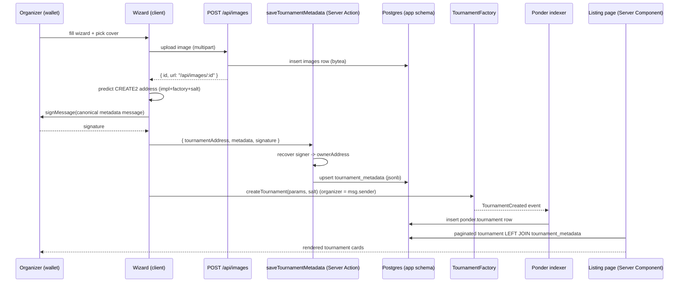

# 003 — Tournament Metadata Store & Listing

> Off-chain store for tournament presentation data (name, description, cover
> image, game/category/tags), written by the organizer alongside on-chain
> creation and surfaced on a paginated tournament listing page.

## Meta

| Field           | Value                                   |
|-----------------|-----------------------------------------|
| **Status**      | Approved                                |
| **Author**      | Ricardo Vinicius                        |
| **Created**     | 2026-07-05                              |
| **Updated**     | 2026-07-05                              |
| **Depends on**  | #001 (create-tournament contract), #002 (create-tournament UI) |
| **Supersedes**  | —                                       |

> **Convention note.** The base spec (`000`) shows the data-model example in
> SQLAlchemy Core; Arbiter's actual stack is **Drizzle ORM + PostgreSQL**, so
> all schema in this spec is expressed as Drizzle table definitions. This is a
> deliberate deviation to match `AGENTS.md`.

---

## Problem Statement

The on-chain `Tournament` clone and the `TournamentCreated` event carry only the
mechanical parameters an indexer needs (format, capacity, fees, prize, dates,
organizer). They intentionally hold **no presentation data** — a tournament has
no human-readable name, description, cover image, game, or tags on-chain, and
putting them there would waste gas and be impossible to edit. Today the create
wizard collects `name`, `description`, and `game` but only `console.log`s them
(`useCreateTournament.ts:103`), so that data is lost. As a result there is no way
to render a browsable list of tournaments for players to discover. This feature
adds the off-chain store for that presentation data and a first listing page that
joins it with the indexed on-chain rows.

---

## Goals & Non-Goals

### Goals
- [ ] Persist tournament presentation metadata off-chain, keyed 1:1 by the
      tournament's predicted CREATE2 address.
- [ ] Store metadata as a flexible `jsonb` document (`name`, `description`,
      `game`, `category`, `tags[]`, `imageUrl`) so its shape can evolve without
      a migration.
- [ ] Let organizers upload a cover/banner image; store the binary in Postgres
      and expose it through a Next.js image API URL referenced from the metadata.
- [ ] Gate metadata writes/updates behind an **organizer wallet signature**
      (recover the signer server-side; only the owner may update).
- [ ] Write metadata **before signing** the creation tx, using the predicted
      address, so it is in place the moment the tournament is indexed.
- [ ] Ship a paginated **tournament listing page** that joins indexed on-chain
      tournaments with their off-chain metadata.

### Non-Goals
- **Not** moving image bytes to external/object/IPFS storage yet — metadata
  stores a resolvable *URL* so that swap is non-breaking later (see Decision Log).
- **Not** garbage-collecting orphaned metadata rows (rows whose creation tx never
  mined). Deferred to a follow-up; orphans are harmless because the listing is
  driven by the indexed table and left-joins metadata (see Business Rules #7).
- **Not** editing metadata from a dedicated UI in this spec (the update *endpoint*
  and its auth exist; a management screen is out of scope).
- **Not** redesigning the listing visually — functionality and data retrieval
  only, per the draft.
- **Not** adding search/filter/sort controls beyond pagination.

---

## Proposed Solution

### Overview



The **indexed `ponder.tournament` table is the source of truth** for which
tournaments exist; `tournament_metadata` is a left-joined enrichment. Metadata
is written ahead of the tx using the deterministic address the existing schema
was designed around (`schema.ts:18-31`).

### User Experience

**Organizer — creating a tournament (extends the #002 wizard):**
1. Fills the wizard as today. On the "Name" step, selects a **cover image**;
   the client uploads it immediately and stores the returned `/api/images/:id`
   URL in form state.
2. On "Review → Deploy": the client generates the salt, predicts the clone
   address, and asks the wallet to **sign a canonical metadata message**
   (gasless — a `personal_sign`, not a transaction).
3. The signed metadata is POSTed to the server action, which recovers the signer,
   records it as the metadata owner, and upserts the row.
4. The client then submits `createTournament` as before. Success screen unchanged.
   - **Error states:** image too large / wrong type → inline field error, deploy
     blocked. Signature rejected → surface "Signature required to save
     tournament details" and abort before the tx. Metadata write fails → abort
     before the tx (do not spend gas on a tournament with no details).

**Player — browsing tournaments (new):**
1. Visits `/discover`.
2. Sees a paginated grid of tournament cards: cover image, name, description
   excerpt, game/category, tags, and on-chain facts (format, capacity, prize,
   dates) from the indexed row.
3. Uses page controls (`?page=N`) to navigate. Tournaments with no metadata (or
   unverified metadata) render with an on-chain-only placeholder card.
   - **Edge cases:** empty list → "No tournaments yet" empty state. Broken/missing
     image → placeholder graphic. `page` out of range → clamp to last page.

### Data Model

Two app-owned tables (Drizzle migrates + writes them). Both live in
`packages/db/src/schema.ts`. The existing `tournamentMetadata` definition
(`schema.ts:32-41`) is **replaced** by the version below.

```ts
import {
  customType, jsonb, pgTable, text, timestamp, uuid, integer,
} from "drizzle-orm/pg-core";

// Postgres `bytea` — Drizzle has no first-class bytea helper; store as Buffer.
const bytea = customType<{ data: Buffer; driverData: Buffer }>({
  dataType: () => "bytea",
});

/**
 * Binary image blobs (tournament covers/banners). Served via a Next.js Route
 * Handler; the app references them by the API URL `/api/images/:id`, never the
 * raw id — so image hosting can later move off-Postgres without a schema change.
 */
export const images = pgTable("images", {
  id: uuid("id").primaryKey().defaultRandom(),
  data: bytea("data").notNull(),
  mimeType: text("mime_type").notNull(),      // allow-listed on upload
  sizeBytes: integer("size_bytes").notNull(),
  createdAt: timestamp("created_at", { withTimezone: true })
    .notNull()
    .defaultNow(),
});

export type ImageRow = typeof images.$inferSelect;
export type NewImageRow = typeof images.$inferInsert;

/**
 * Off-chain tournament presentation data, keyed 1:1 by the predicted CREATE2
 * address (lowercase 0x-hex). NO foreign key to `ponder.tournament`: that table
 * is Ponder-owned, in another schema, and may not exist yet when metadata lands
 * (metadata is written before the creation tx is mined). Reconcile by address
 * in the app layer.
 *
 * `ownerAddress` is the wallet that signed the write; only it may update the
 * row. It is reconciled against the on-chain `organizer` at read time.
 */
export const tournamentMetadata = pgTable("tournament_metadata", {
  tournamentAddress: text("tournament_address").primaryKey(),
  ownerAddress: text("owner_address").notNull(),
  metadata: jsonb("metadata").$type<TournamentMetadataDoc>().notNull(),
  createdAt: timestamp("created_at", { withTimezone: true })
    .notNull()
    .defaultNow(),
  updatedAt: timestamp("updated_at", { withTimezone: true })
    .notNull()
    .defaultNow(),
});

export type TournamentMetadataRow = typeof tournamentMetadata.$inferSelect;
export type NewTournamentMetadataRow = typeof tournamentMetadata.$inferInsert;
```

**`TournamentMetadataDoc`** (the `jsonb` payload; validated by Zod in the web app,
typed here for `$type`):

| Field         | Type       | Rules                                             |
|---------------|------------|---------------------------------------------------|
| `name`        | `string`   | required, 1–255 chars (trimmed)                   |
| `description` | `string?`  | optional, ≤ 2000 chars                            |
| `game`        | `string?`  | optional, ≤ 100 chars                             |
| `category`    | `string?`  | optional, ≤ 100 chars                             |
| `tags`        | `string[]` | 0–20 items, each ≤ 40 chars, de-duplicated        |
| `imageUrl`    | `string?`  | optional; relative `/api/images/:id` or an https URL |

Notes:
- `ownerAddress` is a **column**, not part of the JSON: it is an access-control
  field that must be compared to the on-chain organizer, so it stays typed and
  queryable (the JSON blob choice applies to descriptive metadata only).
- `tournament` (Ponder read-only) is unchanged (`ponderTournament.ts`).

### API Endpoints

Metadata writes are **Server Actions** (matching the `samples` convention —
`createSample.ts`); metadata reads are **server functions** called from Server
Components (metadata is never fetched alone). Image I/O needs binary
request/response bodies, so it uses **Route Handlers** under `app/api/`.

| Method | Path | Kind | Auth | Description |
|--------|------|------|------|-------------|
| — | `saveTournamentMetadata(input)` | Server Action | Signature | Upsert metadata for a predicted address (create on first write). |
| — | `updateTournamentMetadata(input)` | Server Action | Signature (owner) | Update existing metadata; signer must equal `ownerAddress`. |
| `POST` | `/api/images` | Route Handler | None¹ | Upload a cover image (multipart/form-data). Returns `{ id, url }`. |
| `GET`  | `/api/images/:id` | Route Handler | None | Stream image bytes with `Content-Type` + long cache headers. |

¹ Image upload is unauthenticated in this iteration (the metadata write that
references it *is* signed). Rate-limiting/auth on upload is a follow-up.

**Server Action input** (validated by Zod, see schemas below):
```ts
type SaveTournamentMetadataInput = {
  tournamentAddress: `0x${string}`; // predicted CREATE2 clone address
  metadata: TournamentMetadataDoc;  // the jsonb payload
  signature: `0x${string}`;         // personal_sign over the canonical message
};
```
Return shape mirrors `CreateSampleState`: `{ ok?: true } | { error: string }`.

**Canonical signed message** (built by a shared helper so client and server agree
byte-for-byte):
```
Arbiter — save tournament metadata
address: <lowercased tournamentAddress>
hash: <sha-256 hex of canonical-JSON(metadata)>
```
The server recovers the signer with viem `verifyMessage` / `recoverMessageAddress`
and treats it as `ownerAddress`.

**`POST /api/images` response:** `{ "id": "<uuid>", "url": "/api/images/<uuid>" }`
**`GET /api/images/:id`:** `200` with the bytes and `Content-Type: <mimeType>`;
`404` if unknown.

### Frontend Components

| Component | Path | Description |
|-----------|------|-------------|
| `TournamentList` | `features/tournaments/components/TournamentList.tsx` | Server component; renders the grid + `Pagination`. |
| `TournamentCard` | `features/tournaments/components/TournamentCard.tsx` | One tournament: cover, name, excerpt, game/tags, on-chain facts. |
| `Pagination` | `components/ui/pagination.tsx` | shadcn pagination primitive (add via CLI). |
| `CoverImageField` | `features/tournaments/components/wizard/CoverImageField.tsx` | Wizard field: file picker → upload → preview; stores `imageUrl`. |

Modified: `CreateTournamentWizard.tsx` (wire cover field + sign + save on deploy),
`useCreateTournament.ts` (sign message, call `saveTournamentMetadata` before
`writeContract`), `wizard/steps.tsx` (mount `CoverImageField` on the Name step).

### Business Rules
1. **Address key.** `tournamentAddress` is the lowercased predicted CREATE2
   address; the client derives it via `predictCloneAddress` (`lib/predictCloneAddress.ts`).
2. **Signature required.** Every metadata write/update carries a wallet signature
   over the canonical message; the server recovers the signer. No signature → reject.
3. **Owner-only updates.** `updateTournamentMetadata` requires the recovered
   signer to equal the row's `ownerAddress`; otherwise reject (`403`-equivalent).
4. **Write-before-tx.** Metadata is persisted before `createTournament` is signed.
   If the metadata write fails or the signature is rejected, the tx is **not**
   submitted (no gas spent on a detail-less tournament).
5. **Read-time reconciliation.** On the listing, metadata is shown only when
   `tournamentMetadata.ownerAddress === ponder.tournament.organizer`
   (case-insensitive). Mismatched/absent metadata → render an on-chain-only card.
   This makes the on-chain organizer the ground truth and neutralizes any
   pre-mining metadata front-running of a predicted address.
6. **Image validation.** Uploads must be `image/png`, `image/jpeg`, or
   `image/webp` and ≤ 2 MB; otherwise reject with a field error.
7. **Orphans are invisible.** The listing left-joins metadata onto the indexed
   `tournament` table, so metadata rows whose tx never mined simply never appear.
   No cleanup is required for correctness (only DB hygiene — deferred).
8. **Pagination.** `?page` is 1-based and clamped to `[1, lastPage]`. `?pageSize`
   is caller-supplied, defaulting to **12** and clamped to `[1, 48]` (reject/clamp
   out-of-range values so a request can't return an unbounded page). Ordering is
   newest-first (`ponder.tournament` `created_at desc`, tie-break `index desc`).

---

## Implementation Plan

### Backend (db + web server)
1. `packages/db/src/schema.ts` — add the `bytea` custom type, the `images` table,
   and **replace** `tournamentMetadata` with the `jsonb` + `ownerAddress` +
   `createdAt`/`updatedAt` version above. Export the new row types and the
   `TournamentMetadataDoc` type (or import it from a shared location).
2. `apps/web/src/features/tournaments/schema/metadata.ts` — Zod
   `tournamentMetadataSchema` (validates `TournamentMetadataDoc`) + inferred type.
3. `apps/web/src/features/tournaments/lib/metadataMessage.ts` — pure helper
   building the canonical message string from `(address, metadata)` (shared by
   client signing and server verification); include a stable canonical-JSON +
   sha-256 helper.
4. `apps/web/src/features/tournaments/server/verifyOwnerSignature.ts` — thin
   wrapper over viem `verifyMessage`/`recoverMessageAddress` (dependency injected
   for tests); returns the recovered address.
5. `apps/web/src/features/tournaments/server/metadata.ts` (`server-only`) —
   `getMetadata(address)`, `upsertMetadata(row)`, `updateMetadata(row)` using
   Drizzle (`db.insert(...).onConflictDoUpdate` / `db.update`).
6. `apps/web/src/features/tournaments/actions/saveTournamentMetadata.ts`
   (`use server`) — parse input, recover signer, enforce rules #2–#4, upsert.
7. `apps/web/src/features/images/schema/image.ts` — mime allow-list + size Zod schema.
8. `apps/web/src/features/images/server/images.ts` (`server-only`) —
   `storeImage({ data, mimeType })`, `getImage(id)`.
9. `apps/web/src/app/api/images/route.ts` — `POST` handler (parse multipart via
   `request.formData()`, validate, store, return `{ id, url }`).
10. `apps/web/src/app/api/images/[id]/route.ts` — `GET` handler (fetch, stream
    bytes, set `Content-Type` + `Cache-Control: public, max-age=31536000, immutable`).
11. `apps/web/src/features/tournaments/server/listTournaments.ts` (`server-only`) —
    `listTournamentsWithMetadata({ page, pageSize })`: `ponder.tournament`
    left-joined with `tournament_metadata` (Drizzle `leftJoin`), newest-first,
    `limit`/`offset`; plus `countTournaments()` for page math. Apply rule #5
    reconciliation when mapping rows.

### Frontend
1. Add shadcn `pagination` (and `badge` for tags if desired):
   `pnpm --filter @arbiter/web dlx shadcn@latest add pagination`.
2. `features/tournaments/components/wizard/CoverImageField.tsx` — file input →
   `POST /api/images` → preview + store `imageUrl` in RHF state.
3. `features/tournaments/components/wizard/steps.tsx` — mount `CoverImageField`
   on the Name step (replaces the "cover upload deferred" note).
4. `features/tournaments/hooks/useCreateTournament.ts` — replace the
   `console.log` block: build metadata doc + message, `useSignMessage`, call
   `saveTournamentMetadata`; only on success proceed to `writeContract`.
5. `features/tournaments/components/TournamentCard.tsx` and `TournamentList.tsx`.
6. `apps/web/src/app/discover/page.tsx` — Server Component reading
   `listTournamentsWithMetadata`, parsing `searchParams.page` and
   `searchParams.pageSize` (clamped per Business Rule #8); wire `MainNav`'s
   "Discover" link.

### Migrations
1. Generate: `pnpm --filter @arbiter/db db:generate` (creates
   `drizzle/0002_*.sql` — new `images` table + altered `tournament_metadata`).
   Review the generated SQL (the metadata table change drops old
   `name`/`image_url`/`description` columns and adds `owner_address`/`metadata`/
   `created_at`; acceptable since the table is unwritten today).
2. Apply: `pnpm --filter @arbiter/db db:migrate` (or `db:push` in local dev).

---

## Testing Strategy

### Backend Tests
- **Metadata Zod schema** (`metadata.test.ts`): accepts a well-formed doc;
  rejects empty `name`, over-long fields, > 20 tags, duplicate tags; strips/coerces.
- **Canonical message + hash** (`metadataMessage.test.ts`): deterministic output;
  key-order-independent canonical JSON (same doc ⇒ same hash).
- **Signature verification** (`verifyOwnerSignature.test.ts`): sign with a test
  private key (viem `privateKeyToAccount`), assert recovered address matches;
  tampered message/metadata ⇒ mismatch.
- **Save action** (`saveTournamentMetadata.test.ts`, DB mocked with a named fake):
  create writes `ownerAddress = signer`; update by non-owner rejected; bad
  signature rejected; invalid metadata rejected.
- **Image validation + store** (`images.test.ts`): rejects disallowed mime / > 2 MB;
  stores and reads back identical bytes (fake db).
- **Listing join** (`listTournaments.test.ts`, fake db): newest-first order;
  left join keeps tournaments without metadata; rule #5 reconciliation drops
  metadata when `ownerAddress !== organizer`; pagination offset/limit + clamping.

### Frontend Tests (optional)
- `TournamentCard`: renders on-chain-only placeholder when metadata is absent;
  renders cover/name/tags when present.

### Manual Verification
1. Local stack up (hardhat node + factory deployed + indexer + `DATABASE_URL` set).
2. Create a tournament with a cover image; confirm the wallet prompts a
   **signature** (no gas) then the **transaction**.
3. Inspect DB: `tournament_metadata` row exists keyed by the clone address, with
   `owner_address` = your wallet and the `jsonb` payload; `images` row has bytes.
4. `GET /api/images/:id` returns the image; the card on `/discover` shows it.
5. Once the indexer picks up `TournamentCreated`, the tournament appears on
   `/discover` with its metadata. Create > 12 to verify pagination.

---

## Decision Log

| Date | Decision | Rationale |
|------|----------|-----------|
| 2026-07-05 | Metadata stored as a single `jsonb` document | Flexibility to evolve the presentation shape without migrations (per draft + user choice). |
| 2026-07-05 | Images stored as `bytea` in Postgres, referenced by an `/api/images/:id` **URL** in metadata | User choice: keep the reference URL-shaped so hosting can move off-Postgres (S3/IPFS) later without a schema/metadata break. |
| 2026-07-05 | Write metadata **before** signing the creation tx (predicted address) | Metadata is present the instant the tournament is indexed; the existing table was designed around the deterministic address. Orphan risk accepted (invisible via left join). |
| 2026-07-05 | Metadata writes require an **organizer wallet signature**; reconcile `ownerAddress` vs on-chain `organizer` at read time | Prevents spoofing metadata for someone else's tournament; on-chain organizer is ground truth (`organizer = msg.sender`, `TournamentFactory.sol:47`). |
| 2026-07-05 | **No** `tournament_id` FK to a `tournaments` table (contra the draft) | `tournament` is Ponder-owned, read-only, in another schema, and may not exist when metadata is written. Reconcile by address (existing design, `schema.ts:18-31`). |
| 2026-07-05 | Metadata via Server Actions; images via Route Handlers | Matches the `samples` Server-Action convention; binary I/O requires Route Handlers. |
| 2026-07-05 | No replay nonce/timestamp in the signed message | Owner-only updates + read-time reconciliation make replay low-risk; deferred per review. |
| 2026-07-05 | Listing lives at `/discover` | Confirmed in review; `MainNav` already links it. |
| 2026-07-05 | Expose `?pageSize` (default 12, clamped `[1, 48]`) | Confirmed in review; clamp keeps pages bounded. |

---

## References

- Draft notes: previous content of this file (superseded by this spec).
- `packages/contracts/contracts/TournamentFactory.sol` — `createTournament`,
  `organizer = msg.sender`, `TournamentCreated` event, `predictTournamentAddress`.
- `packages/db/src/schema.ts` / `ponderTournament.ts` — existing tables & keying.
- `apps/web/src/features/tournaments/` — wizard, `useCreateTournament`,
  `predictCloneAddress`.
- viem message signing/recovery: https://viem.sh/docs/actions/wallet/signMessage.md,
  https://viem.sh/docs/utilities/verifyMessage.md
- Drizzle `jsonb` / `customType` / `leftJoin`: https://orm.drizzle.team/docs/
