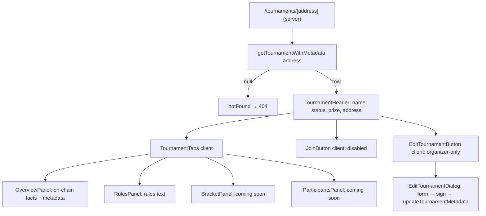

# 004 — Tournament Details Page

> A public, server-rendered page at `/tournaments/[address]` that shows a single
> tournament's on-chain facts and off-chain presentation metadata, with an
> organizer-only edit dialog. Bracket, participants, match, and voting sections
> are scaffolded as "coming soon" and deferred to future specs.

## Meta

| Field           | Value                          |
|-----------------|--------------------------------|
| **Status**      | Approved                       |
| **Author**      | Ricardo Vinicius               |
| **Created**     | 2026-07-07                     |
| **Updated**     | 2026-07-07                     |
| **Depends on**  | Tournament creation + metadata/listing (existing: `listTournamentsWithMetadata`, `tournament_metadata`, Ponder `tournament` index) |
| **Supersedes**  | — |

---

## Problem Statement

Users can create tournaments (`/tournaments/new`) and browse them in a grid
(`/discover`), but there is no way to open a single tournament and see its
details. A viewer who clicks a `TournamentCard` has nowhere to go. Organizers
likewise have no surface to review or correct a tournament's off-chain
presentation (name, description, cover, tags) after creation.

This spec introduces the tournament details page: a canonical, shareable URL per
tournament that renders everything the platform *currently* knows about it, and
gives the organizer an in-place way to edit its metadata.

---

## Goals & Non-Goals

### Goals
- [ ] Add route `/tournaments/[address]` as a server component that fetches one
      tournament (indexed on-chain row + reconciled metadata) and renders it.
- [ ] Display on-chain facts: organizer, format, capacity (`maxPlayers`),
      `entryFee`, `prize`, `startDate`, `endDate`, contract address.
- [ ] Display off-chain metadata: name, description, game, category, tags, cover
      image, and a new `rules` field.
- [ ] Derive and display a tournament status using the design's badge wording:
      **Soon / LIVE / Finished**.
- [ ] Provide a tabbed layout (Bracket · Overview · Participants · Rules) matching
      the design, where Bracket and Participants render honest "coming soon"
      empty states.
- [ ] Render a **Join** CTA in a disabled "registration not yet available" state
      with eligibility-messaging structure ready for a future enrollment spec.
- [ ] Provide an organizer-only **Edit** button that opens a modal to edit the
      metadata fields, signs the change (wagmi `personal_sign`), and persists via
      the existing `updateTournamentMetadata` server action.
- [ ] Add a `rules` field to the tournament metadata document (no DB migration —
      it lives inside the existing `metadata` jsonb blob).
- [ ] Return a 404 for addresses that are not indexed tournaments.

### Non-Goals
- Bracket rendering, match tracking, or match-result display (no backing data
  exists on-chain or off-chain). Deferred.
- Participant/enrollment lists and any working "Join" transaction (no enrollment
  mechanism exists; `entryFee` is stored on-chain but never collected). Deferred.
- Match voting, judge vote display, or the per-match drawer. Deferred.
- Any smart-contract changes or new indexer events.
- New off-chain tables for participants/matches/votes.
- A separate `/tournaments/[address]/manage` route (edit is an in-page modal).

---

## Proposed Solution

### Overview

The page follows the existing `/discover` pattern: a `force-dynamic` server
component fetches from Postgres (Ponder-indexed `tournament` row left-joined to
the app-owned `tournament_metadata`, reconciled by owner) and passes plain data
to presentational components. Only the wallet-gated islands — the Join CTA and
the organizer Edit dialog — are client components.



### User Experience

**Viewer (anyone, connected or not)**
1. Clicks a `TournamentCard` on `/discover` → navigates to `/tournaments/<address>`.
2. Sees the header (name or shortened address fallback, status badge, format,
   capacity, prize, contract address) and the tab strip.
3. **Overview** tab (default): description, game, category, tags, dates, entry
   fee, prize, organizer address.
4. **Rules** tab: the `rules` text, or an empty state if unset.
5. **Bracket** / **Participants** tabs: a centered "coming soon" empty state.
6. The **Join** button is visible but disabled with a tooltip/subtext:
   "Registration is not open yet."

**Organizer (connected wallet === on-chain `organizer`)**
1. Additionally sees an **Edit** button in the header.
2. Clicks it → a modal (shadcn `Dialog`) opens with a form pre-filled from
   current metadata (name, description, game, category, tags, image, rules).
3. Submits → the app builds the canonical message (`buildMetadataMessage`), asks
   the wallet to sign it (`useSignMessage`), calls `updateTournamentMetadata`,
   and on success closes the modal and refreshes the page data.
4. On error (rejected signature, non-owner, server error) an inline error string
   is shown; the modal stays open.

**Edge cases & error states**
- **Address not indexed** → `notFound()` (Next 404 page).
- **Malformed address param** (not `0x` + 40 hex) → `notFound()`.
- **Indexed but no/untrusted metadata** → render on-chain facts only; name falls
  back to the shortened address; description/rules show empty states.
- **Wallet not connected** → no Edit button; Join disabled.
- **Connected but not organizer** → no Edit button.

### Data Model

No schema/DDL changes. The new `rules` field is added to the presentation
document persisted in the existing `tournament_metadata.metadata` jsonb column,
so it requires only a type + Zod change, not a migration.

`TournamentMetadataDoc` (in `@arbiter/db`) and `tournamentMetadataSchema`
(`apps/web/src/features/tournaments/schema/metadata.ts`) gain:

```ts
// schema/metadata.ts — added to tournamentMetadataSchema
rules: z.string().trim().max(5000).optional(),
```

The compile-time assertions in `metadata.ts` (`_assertSchemaMatchesDb` /
`_assertDbMatchesSchema`) enforce that `TournamentMetadataDoc` is updated in
lockstep — update both or the type-check fails.

On-chain data is read via the existing read-only Drizzle mapping of the Ponder
`tournament` table (`packages/db/src/ponderTournament.ts`); this spec adds no
columns there.

### Server Functions

New single-row fetch, colocated with the existing list function and reusing its
`reconcile` rule (metadata trusted only when `ownerAddress` === on-chain
`organizer`).

| Function | Path | Description |
|----------|------|-------------|
| `getTournamentWithMetadata(address)` | `features/tournaments/server/getTournament.ts` | Returns `TournamentListItem \| null` for one lowercased address (indexed row + reconciled metadata), or `null` if not indexed. |

Reuses existing, unchanged:
- `updateTournamentMetadata(input)` — `actions/saveTournamentMetadata.ts` (already
  signature-gated and owner-checked). This spec adds
  `revalidatePath("/tournaments/[address]", "page")` alongside the existing
  `/discover` revalidation so edits reflect immediately on the details page.
- `buildMetadataMessage` — `lib/metadataMessage.ts` (client signing).
- `recoverMetadataSigner` / `getMetadata` / `updateMetadata` — server side.

### Frontend Components

| Component | Path | Description |
|-----------|------|-------------|
| `TournamentDetailsPage` | `app/tournaments/[address]/page.tsx` | Route entry only: validate param, fetch, `notFound()` or render `TournamentDetails`. |
| `TournamentDetails` | `features/tournaments/components/details/TournamentDetails.tsx` | Server component; lays out header + tabs from a `TournamentListItem`. |
| `TournamentHeader` | `features/tournaments/components/details/TournamentHeader.tsx` | Name/status/format/capacity/prize/address; slots for Join + Edit islands. |
| `TournamentStatusBadge` | `features/tournaments/components/details/TournamentStatusBadge.tsx` | Renders Soon/LIVE/Finished from dates (LIVE uses the lime accent). |
| `TournamentTabs` | `features/tournaments/components/details/TournamentTabs.tsx` | Client; shadcn `Tabs` (Bracket · Overview · Participants · Rules). |
| `OverviewPanel` | `features/tournaments/components/details/OverviewPanel.tsx` | On-chain facts + metadata. |
| `RulesPanel` | `features/tournaments/components/details/RulesPanel.tsx` | Rules text or empty state. |
| `ComingSoonPanel` | `features/tournaments/components/details/ComingSoonPanel.tsx` | Shared empty state for Bracket + Participants. |
| `JoinTournamentButton` | `features/tournaments/components/details/JoinTournamentButton.tsx` | Client; disabled CTA + eligibility message shell. |
| `EditTournamentButton` | `features/tournaments/components/details/EditTournamentButton.tsx` | Client; renders only when connected address === organizer; opens dialog. |
| `EditTournamentDialog` | `features/tournaments/components/details/EditTournamentForm.tsx` | Client; shadcn `Dialog` + metadata form; sign + `updateTournamentMetadata`. |

New shadcn primitives to install into `src/components/ui`: **`tabs`**, **`dialog`**.
(`Drawer` and `Collapsible` are intentionally not added — the features that would
need them are deferred.)

### Business Rules

1. **Route param is the contract address** (CREATE2 clone address), matched
   case-insensitively and lowercased before lookup.
2. **Existence is on-chain.** A tournament "exists" iff it has a Ponder
   `tournament` row. No row → 404, regardless of any orphan metadata.
3. **Metadata trust = owner reconciliation.** Metadata is shown only when its
   `ownerAddress` equals the on-chain `organizer`; otherwise render on-chain only.
4. **Status derivation** (server, from indexed `startDate`/`endDate` vs. request
   time), using the design's badge wording: `now < startDate` → **Soon**;
   `startDate ≤ now ≤ endDate` → **LIVE**; `now > endDate` → **Finished**. The
   design's **Reg open** label is reserved for a future enrollment spec (Join is
   inert here), so it is not emitted by this page.
5. **Edit authority is the signature.** The organizer client signs the canonical
   metadata message; the server recovers the signer and rejects unless it equals
   the stored `ownerAddress` (existing behavior — unchanged).
6. **Edit visibility ≠ authority.** Hiding the Edit button for non-organizers is
   UX only; the server action remains the security boundary.
7. **Join is inert** in this spec: always disabled with an explanatory message;
   it must not submit any transaction.
8. **`entryFee` is always shown** on the Overview tab, formatted from wei, with a
   short note that it is not collected yet (fees are stored on-chain but not
   enforced today).
9. **`rules` is plain text** — rendered with preserved whitespace/line breaks
   (e.g. `whitespace-pre-wrap`), not parsed as Markdown or HTML.
10. **No raw non-ASCII in UI strings** — use unicode escapes per project
   conventions (e.g. the `Ξ` prize symbol as `Ξ`, `·` as `·`).

---

## Implementation Plan

### Backend / Shared
1. `@arbiter/db`: add optional `rules?: string` to `TournamentMetadataDoc`.
2. `features/tournaments/schema/metadata.ts`: add `rules` to
   `tournamentMetadataSchema` (keeps the compile-time doc assertions valid).
3. `features/tournaments/server/getTournament.ts`: implement
   `getTournamentWithMetadata(address)` (single-row query + shared reconcile).
   Export/lift the `reconcile` helper from `listTournaments.ts` to avoid
   duplication.
4. `actions/saveTournamentMetadata.ts`: add
   `revalidatePath("/tournaments/[address]", "page")` to `updateTournamentMetadata`.

### Frontend
1. Install shadcn `tabs` and `dialog` into `src/components/ui`.
2. Create `app/tournaments/[address]/page.tsx` (`export const dynamic =
   "force-dynamic"`): read `params.address`, validate hex address, call
   `getTournamentWithMetadata`, `notFound()` when null, else render.
3. Build the `details/` presentational components (header, status badge, tabs,
   overview, rules, coming-soon).
4. Build the client islands: `JoinTournamentButton` (disabled), and
   `EditTournamentButton` + `EditTournamentForm` reusing `useWalletConnect`,
   `useSignMessage`, `buildMetadataMessage`, and `updateTournamentMetadata`.
5. Add an `app/tournaments/[address]/loading.tsx` skeleton (shadcn `Skeleton`).
6. Link `TournamentCard` (`/discover`) to `/tournaments/<address>`.

### Migrations
- **None.** `rules` lives in the existing `metadata` jsonb blob; no DDL.

---

## Testing Strategy

### Backend / Unit
- `getTournamentWithMetadata`: returns row for an indexed address; returns `null`
  for an unknown address; drops metadata whose `ownerAddress` ≠ `organizer`
  (reuse the fake DB pattern used by existing tournament server tests).
- Status derivation helper: Soon / LIVE / Finished at the three boundary regions
  (before start, between, after end).
- `tournamentMetadataSchema`: accepts a valid `rules` string; rejects `rules`
  over 5000 chars; treats it as optional.
- `updateTournamentMetadata`: round-trips a metadata doc that includes `rules`
  (signature accepted for owner, rejected for non-owner) — extend existing tests.

### Frontend Tests
- `TournamentStatusBadge` renders the correct label per status.
- `EditTournamentButton` renders nothing when disconnected or when the connected
  address ≠ organizer; renders the trigger when it matches.
- `EditTournamentForm` calls `updateTournamentMetadata` with the signed payload
  on submit and surfaces the returned error string on failure (mock the action
  and `useSignMessage`).

### Manual Verification
1. `pnpm build` succeeds (catches cross-package/bundler issues per AGENTS.md).
2. Create a tournament via `/tournaments/new`; open `/tournaments/<address>`.
3. Verify header facts match the create inputs and the status matches the dates.
4. As the organizer wallet: edit name/description/rules/tags, sign, confirm the
   page reflects the change after refresh.
5. As a different wallet: confirm no Edit button and a disabled Join button.
6. Visit `/tournaments/0x<random-non-existent>` → 404.

---

## Open Questions

> All resolved (see Decision Log). None outstanding.

---

## Decision Log

| Date | Decision | Rationale |
|------|----------|-----------|
| 2026-07-07 | Scope to a display page; defer brackets/participants/matches/voting to future specs as "coming soon" states. | No on-chain or off-chain data backs those features; shipping honest empty states beats fabricating data. |
| 2026-07-07 | Render Join as a disabled CTA. | No enrollment mechanism exists and entry fees are not collected on-chain. |
| 2026-07-07 | Add a `rules` field to the metadata jsonb doc (no migration). | Draft calls for editable rules; jsonb storage means no DDL, only a type + Zod change. |
| 2026-07-07 | Edit is an in-page `Dialog`, not a `/manage` route. | Matches the draft's wording; smallest surface for a metadata-only edit. |
| 2026-07-07 | Reuse the existing signature-gated `updateTournamentMetadata` action. | Owner verification is already implemented and tested; the edit flow only needs UI. |
| 2026-07-07 | Status badge uses design wording **Soon / LIVE / Finished**; **Reg open** reserved for future enrollment. | Consistency with the design; Join is inert, so a "Reg open" label would over-promise. |
| 2026-07-07 | Always show `entryFee` on Overview, with a "not collected yet" note. | Transparency about configured tournament economics without implying payment is enforced today. |
| 2026-07-07 | `rules` is plain text with preserved line breaks (not Markdown). | Simplest safe rendering; avoids a Markdown/sanitization dependency for a v1 field. |

---

## References

- Draft notes (this file's prior revision) — original feature description.
- Design: `docs/design_extracted/prot-tipos-dapp-torneios-web3/` (Shadcn hi-fi +
  wireframes; bracket/participants/voting shown are the future target, not this
  spec's scope).
- Existing patterns: `app/discover/page.tsx`, `features/tournaments/server/listTournaments.ts`,
  `features/tournaments/actions/saveTournamentMetadata.ts`, `lib/metadataMessage.ts`.
