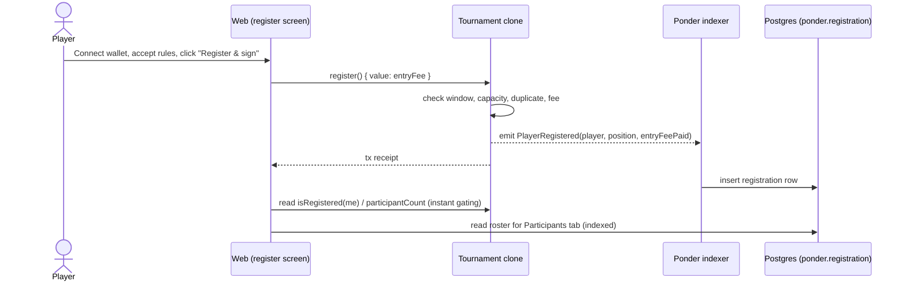

# 005 — Player Registration

> On-chain self-registration of players into a tournament: a payable `register()`
> on the Tournament clone that enforces the entry fee, capacity, and registration
> window; a Ponder handler that indexes registrations; and a Participants tab plus a
> registration screen in the web app.

## Meta

| Field           | Value                          |
|-----------------|--------------------------------|
| **Status**      | Review                         |
| **Author**      | Ricardo Vinicius               |
| **Created**     | 2026-07-09                     |
| **Updated**     | 2026-07-09                     |
| **Depends on**  | #001 (factory & Tournament clone), #002 (creation wizard + indexer), #003 (metadata store), #004 (details page) |
| **Supersedes**  | —                              |

---

## Problem Statement

Tournaments can be created, discovered, and viewed, but **no one can join them**. The
`Tournament` clone stores `maxPlayers` and `entryFee` yet has no registration logic;
`entryFee` is stored and never collected. On the web app the Join button is inert
("Registration is not open yet") and the Participants tab is a "coming soon"
placeholder. This feature lets a wallet self-register for a tournament, pay the entry
fee on-chain, and see the roster fill up — the first competitive interaction in the
platform and the prerequisite for future bracket seeding.

---

## Goals & Non-Goals

### Goals
- [ ] Add a payable `register()` to `Tournament.sol` that enrolls `msg.sender`, collects the entry fee in native ETH, and enforces window/capacity/duplicate/fee rules.
- [ ] Expose on-chain views (`isRegistered`, `participantCount`, `getParticipants`) so the UI can gate actions without waiting on the indexer.
- [ ] Emit a `PlayerRegistered` event and index it with Ponder into a `registration` table keyed by tournament + player.
- [ ] Add a read-only Drizzle mapping of the indexed `registration` table for the web app.
- [ ] Replace the disabled Join button with a real registration flow (dedicated screen) that handles all states (fee/free, full, closed, already-registered, wrong chain, disconnected).
- [ ] Replace the Participants "coming soon" placeholder with a real roster: slots-filled counter + list of registered addresses in registration order with join time.

### Non-Goals
- **Player metadata** (nickname, avatar, in-game handle) — explicitly deferred; registration is address-only for this spec. The design's name/avatar fields are out of scope.
- **Withdrawal / unregister / refunds** — registration is **final** for this MVP. `unregister()` and the refund path are a future spec; the contract is designed to leave room for them but ships none.
- **Entry-fee payout / distribution** — fees accumulate in the Tournament contract. Who receives them (winner, organizer, split) is out of scope.
- **Bracket seeding / matches** — registration order is recorded (`position`) but no bracket is generated.
- **ERC-20 entry fees** — native ETH only, matching the existing `prize` deposit model.
- **On-chain proof of rules acceptance** — the "accept rules" checkbox is a client-side gate only (see Open Questions).

---

## Proposed Solution

### Overview

Registration lives on the **Tournament clone** (each tournament owns its participant
state), mirroring how the clone already owns config and the prize pot. The flow:



On-chain reads (`isRegistered`, `participantCount`) give the UI **instant** post-tx
gating; the **roster list** is read from the indexer (eventually-consistent), matching
the existing tournament read pattern.

### User Experience

**Entry points**
- The Participants tab and the details-page header both surface a **Register** call to action that routes to a dedicated registration screen at `/tournaments/[address]/register`.

**Registration screen (`/tournaments/[address]/register`)** — modeled on design
section 5 (`docs/design_extracted/.../Shadcn-print-1r57f3v.dc.html:338`), minus the
out-of-scope name/avatar/handle fields:
- **Left summary** (reuses existing formatting helpers): cover/name, organizer, status badge, format & capacity, **slots filled `X / maxPlayers`**, prize, **entry fee** (or "Free").
- **Right panel**:
  - Title "Register to play" and a one-line explainer that joining is recorded on-chain.
  - A **rules-acceptance checkbox** ("I have read and accept the tournament rules & judging policy") — client-side required before the button enables.
  - Primary **"Register & sign"** button.
  - Helper text showing the fee to pay (`entryFee` in ETH, or "Free") and that gas applies.

**Key flow (happy path)**
1. Player connects wallet (existing `WalletConnect`), on the correct chain.
2. Player checks the rules box; the button enables.
3. Click sends `register()` with `value = entryFee`.
4. On mined receipt: show success, mark as registered, and route back to the Participants tab (or refresh it).
5. Indexer picks up `PlayerRegistered`; the roster shows the new player.

**Edge cases & error states** (button is disabled with an explanatory message unless noted):

| Condition | Detection | UI |
|-----------|-----------|-----|
| Wallet not connected | wagmi `useAccount` | Prompt to connect |
| Wrong chain | `chainId !== tournamentChainId` | "Switch network" action |
| Registration closed (`now >= startDate`) | on-chain view / derived status | Disabled: "Registration is closed" |
| Tournament full (`participantCount >= maxPlayers`) | `participantCount` read | Disabled: "Tournament is full" |
| Already registered | `isRegistered(me)` read | Disabled: "You are already registered" + roster highlight |
| Rules not accepted | local state | Disabled until checked |
| Insufficient balance for fee + gas | wagmi/simulate error | Surfaced error string |
| Tx reverted (race: filled/closed between read and mine) | receipt/simulate revert | Decode custom error → human message |
| `entryFee == 0` (free) | `entryFee` read | Button shows "Register", `value: 0n` |

**Participants tab** (replaces `ComingSoonPanel`): a **`X / maxPlayers`** slots-filled
header, then a list of registered players in **registration order** — shortened address
(monospace), a placeholder avatar from address initials, and join time. The connected
wallet's own row is not specially highlighted in this spec (deferred). Empty state:
"No players have registered yet."

### Data Model

**Indexer — new `registration` table (Ponder-owned, `apps/indexer/ponder.schema.ts`).**
Ponder must track the dynamically-created Tournament clones via its factory pattern
(child contracts discovered from `TournamentFactory.TournamentCreated`).

```ts
// apps/indexer/ponder.schema.ts
import { index, onchainTable } from "ponder";

export const registration = onchainTable(
  "registration",
  (t) => ({
    id: t.text("id").primaryKey(), // `${tournament}-${player}` (lowercased)
    tournament: t.hex("tournament").notNull(), // clone address (log source)
    player: t.hex("player").notNull(),
    position: t.integer("position").notNull(), // 0-based registration order (seed)
    entryFeePaid: t.bigint("entry_fee_paid").notNull(), // wei
    blockNumber: t.bigint("block_number").notNull(),
    txHash: t.hex("tx_hash").notNull(),
    registeredAt: t.timestamp("registered_at").notNull(), // block timestamp
  }),
  // Index on `tournament` so "all participants of a tournament" is an index
  // scan, not a full-table scan — the dominant query for the roster.
  (table) => ({
    tournamentIdx: index().on(table.tournament),
  }),
);
```

**DB — read-only Drizzle mapping (`packages/db/src/ponderRegistration.ts`)**, following
`ponderTournament.ts`:

```ts
const ponder = pgSchema("ponder");
export const registration = ponder.table("registration", {
  id: text("id").primaryKey(),
  tournament: text("tournament").notNull(),
  player: text("player").notNull(),
  position: integer("position").notNull(),
  entryFeePaid: numeric("entry_fee_paid", { precision: 78, scale: 0 }).notNull(),
  blockNumber: numeric("block_number", { precision: 78, scale: 0 }).notNull(),
  txHash: text("tx_hash").notNull(),
  registeredAt: timestamp("registered_at").notNull(),
});
```

The `tournament` index is created and owned by the indexer (Ponder), so it is not
redeclared here. No app-owned migration is required (no player metadata this spec);
the `ponder` schema is managed by the indexer, not Drizzle.

### On-chain Interface

Additions to `packages/contracts/contracts/Tournament.sol`.

**Storage**
```solidity
mapping(address => bool) public isRegistered; // O(1) membership + eligibility
address[] private _participants;              // enumerable roster (registration order)
```
`participantCount` is derived from `_participants.length` (see views); no separate
counter to keep a single source of truth.

**Function**
```solidity
/// @notice Self-register the caller into the tournament, paying the entry fee.
/// @dev Registration is final in this version (no withdrawal). Open until startDate.
///      No external calls are made, so no reentrancy guard is required.
/// Example: tournament.register{value: entryFee}();
function register() external payable {
    if (block.timestamp >= startDate) revert RegistrationClosed(uint64(block.timestamp), startDate);
    if (isRegistered[msg.sender]) revert AlreadyRegistered(msg.sender);
    if (_participants.length >= maxPlayers) revert TournamentFull(maxPlayers);
    if (msg.value != entryFee) revert IncorrectEntryFee(msg.value, entryFee);

    uint32 position = uint32(_participants.length);
    isRegistered[msg.sender] = true;
    _participants.push(msg.sender);

    emit PlayerRegistered(msg.sender, position, msg.value);
}
```

**Views**
```solidity
function participantCount() external view returns (uint256);
function getParticipants(uint256 offset, uint256 limit) external view returns (address[] memory); // clamped, mirrors factory pagination
```

**Event**
```solidity
event PlayerRegistered(
    address indexed player,
    uint32  indexed position, // 0-based registration order (future bracket seed)
    uint256 entryFeePaid      // wei
);
```

**Custom errors** (custom-errors-only convention, values included):
```solidity
error RegistrationClosed(uint64 nowTs, uint64 startDate);
error AlreadyRegistered(address player);
error TournamentFull(uint32 maxPlayers);
error IncorrectEntryFee(uint256 provided, uint256 required);
```

### Frontend Components

| Component / module | Path | Description |
|--------------------|------|-------------|
| `useRegisterForTournament` | `apps/web/src/features/tournaments/hooks/useRegisterForTournament.ts` | Wraps `useWriteContract(register)` with `value: entryFee`, `useWaitForTransactionReceipt`, and `useReadContract` for `isRegistered(me)` / `participantCount`. Returns gating flags + `register()`. |
| `RegisterTournamentScreen` | `apps/web/src/features/tournaments/components/register/RegisterTournamentScreen.tsx` | Layout for `/tournaments/[address]/register`: summary sidebar + rules checkbox + button. |
| `RegisterButton` | `apps/web/src/features/tournaments/components/register/RegisterButton.tsx` | Stateful CTA (connect / switch / closed / full / already / free / fee / pending / success). Replaces the inert `JoinTournamentButton`. |
| `ParticipantsPanel` | `apps/web/src/features/tournaments/components/details/ParticipantsPanel.tsx` | Server component; renders slots-filled counter + ordered roster. Replaces the Participants `ComingSoonPanel`. |
| `listRegistrations` / `countRegistrations` | `apps/web/src/features/tournaments/server/getRegistrations.ts` | Query `ponder.registration` by tournament, ordered by `position`. |
| Route | `apps/web/src/app/tournaments/[address]/register/page.tsx` | Route entry only: validate address, load tournament, render `RegisterTournamentScreen`. |

Reuse existing helpers: `formatTournament.ts` (ETH/format labels), `tournamentStatus.ts`
(window derivation), `tournamentChainId` / `tournamentFactoryAddress`, `tournamentAbi`.

### Business Rules
1. **Self-only, permissionless.** Anyone may call `register()`; only `msg.sender` is enrolled. Registering on behalf of another address is impossible. The organizer is **not** barred from registering.
2. **Window.** Registration is open from creation until `block.timestamp >= startDate`, then reverts (`RegistrationClosed`). `startDate` is the deadline; no separate field.
3. **Capacity.** Reverts once `_participants.length >= maxPlayers` (`TournamentFull`).
4. **No duplicates.** A second `register()` from the same address reverts (`AlreadyRegistered`).
5. **Exact fee.** `msg.value` must equal `entryFee` exactly (`IncorrectEntryFee`); `entryFee == 0` requires `value == 0`. Fees are held in the contract; no payout or refund this spec.
6. **Finality.** No withdrawal; a registration cannot be undone in this version.
7. **Order is seed.** `position` is the 0-based registration index, recorded for future bracket seeding.
8. **On-chain is truth; indexer is roster.** Eligibility/capacity gating reads on-chain views; the displayed roster reads the indexed table (eventually consistent).

---

## Implementation Plan

### Contracts (`packages/contracts`)
1. `contracts/Tournament.sol`: add storage (`isRegistered`, `_participants`), `register()`, `participantCount()`, `getParticipants(offset, limit)`, `PlayerRegistered` event, and the four custom errors.
2. `contracts/Tournament.t.sol`: add forge unit tests (see Testing).
3. `test/Tournament.ts` (or extend existing): viem integration test that registers via a wallet client and asserts event args + `getParticipants`.
4. Run `pnpm --filter @arbiter/contracts build` to recompile and regenerate `src/generated/abi.ts` (never hand-edit). Confirm `register`/`PlayerRegistered` appear in `tournamentAbi`.

### Indexer (`apps/indexer`)
1. `ponder.config.ts`: register the `Tournament` clones as a factory-discovered contract (source = `TournamentFactory.TournamentCreated`, address param = `tournament`), using `tournamentAbi`.
2. `ponder.schema.ts`: add the `registration` table.
3. `src/index.ts`: add `ponder.on("Tournament:PlayerRegistered", ...)` inserting a row via a `toRegistrationRow(event)` decoder (`src/toRegistrationRow.ts`), id = `${tournament}-${player}` lowercased, `registeredAt` from block timestamp.

### DB (`packages/db`)
1. Add `src/ponderRegistration.ts` mapping the read-only `ponder.registration` table; export types and re-export from the package index. No Drizzle migration.

### Frontend (`apps/web`)
1. `hooks/useRegisterForTournament.ts`: writes `register()` with `value: entryFee`; reads `isRegistered(address)` and `participantCount`; exposes `{ isConnected, wrongChain, isClosed, isFull, alreadyRegistered, canSubmit, busy, isSuccess, error, register, switchNetwork }`.
2. `server/getRegistrations.ts`: `listRegistrations(tournamentAddress)` + `countRegistrations(tournamentAddress)` against `ponder.registration`, ordered by `position`.
3. `components/register/RegisterTournamentScreen.tsx` + `RegisterButton.tsx`; add route `app/tournaments/[address]/register/page.tsx` (entry only, per App Router convention).
4. `components/details/ParticipantsPanel.tsx`: replace the Participants `ComingSoonPanel` in `TournamentTabs.tsx`; render slots counter + ordered roster.
5. Replace `JoinTournamentButton` usage: the header/participants CTA links to the register route (enabled only when the window is open and capacity remains).

### Migrations
- None (app-owned schema unchanged). The `ponder.registration` table is created by the indexer on startup; document a fresh indexer sync for existing tournaments.

---

## Testing Strategy

### Contract Tests (forge, `Tournament.t.sol`)
- Happy path: `register()` marks `isRegistered`, appends to `_participants`, `position` correct, emits `PlayerRegistered` with expected args (`vm.expectEmit`).
- Fee: exact `entryFee` succeeds and increases contract balance; wrong/zero `value` reverts `IncorrectEntryFee`; free tournament (`entryFee == 0`) requires `value == 0`.
- Window: reverts `RegistrationClosed` when `block.timestamp >= startDate` (`vm.warp`).
- Capacity: fill to `maxPlayers`, next registrant reverts `TournamentFull`.
- Duplicate: same address twice reverts `AlreadyRegistered`.
- Views: `participantCount` and `getParticipants(offset, limit)` return correct, clamped results.

### Integration Tests (viem, `test/`)
- Deploy factory + clone, register from two wallet clients with `value: entryFee`, assert event args (`viem.assertions.emitWithArgs`) and roster ordering.

### Indexer Tests
- Given a `PlayerRegistered` log, `toRegistrationRow` produces the expected row (id, position, wei, timestamp). Assert factory-discovery config compiles and matches `tournamentAbi`.

### Frontend Tests
- `useRegisterForTournament` gating logic (closed / full / already / wrong chain / disconnected / free vs fee) with mocked wagmi hooks (named fake, not inline stub).
- `ParticipantsPanel` renders counter and ordered rows from a fake `listRegistrations`.

### Manual Verification
1. `pnpm build` (catch cross-package/bundler issues), start chain + indexer + web.
2. Create a paid tournament; from a second wallet, open `/tournaments/[address]/register`, accept rules, register, confirm the tx, and see balance move by `entryFee`.
3. Confirm the Participants tab shows `1 / maxPlayers` and the address after the indexer catches up; re-registering is blocked; the button reflects full/closed states.

---

## Open Questions

> All questions resolved (see Decision Log). None block implementation.

---

## Decision Log

| Date | Decision | Rationale |
|------|----------|-----------|
| 2026-07-09 | Registration is **final** (no withdrawal/refund) for MVP | Smallest contract surface; withdrawal deferred to a future spec. Contract leaves room for it. |
| 2026-07-09 | Registration window = **open until `startDate`** | Reuses existing fields; no `TournamentParams`/wizard/indexer churn. |
| 2026-07-09 | **Self-only, permissionless**; organizer not excluded | Matches "connect wallet & sign" flow; minimal checks. |
| 2026-07-09 | Entry fee = **native ETH, held in contract** | Mirrors the existing prize deposit; payout is a later spec. |
| 2026-07-09 | On-chain storage = **mapping + count + enumerable array** | Enables instant UI gating and trustless views; roster list still served by the indexer. |
| 2026-07-09 | Participants UI = **address + registration order + count** | Player metadata (name/avatar) is out of scope for this spec. |
| 2026-07-09 | Index the `registration.tournament` column | "All participants of a tournament" is the dominant query; an index turns it into an index scan instead of a full-table scan. |
| 2026-07-09 | Rules acceptance = **client-side checkbox only** | No signature/on-chain proof for MVP; the checkbox is a UI gate before the register tx. |
| 2026-07-09 | Registration UX = **dedicated route** (`/tournaments/[address]/register`) | Matches the draft's "screen of registration"; not an inline modal. |

---

## References
- Draft notes (original `005_register.md`).
- Design: `docs/design_extracted/prot-tipos-dapp-torneios-web3/project/Tournaments DApp Shadcn-print-1r57f3v.dc.html` (Register to play, section 5, lines ~338–443).
- Prior specs: #001 (`Tournament`/factory), #002 (indexer + wizard), #003 (metadata store), #004 (details page tabs).
- Existing patterns to mirror: `apps/indexer/ponder.schema.ts`, `packages/db/src/ponderTournament.ts`, `apps/web/src/features/tournaments/hooks/useCreateTournament.ts`.
