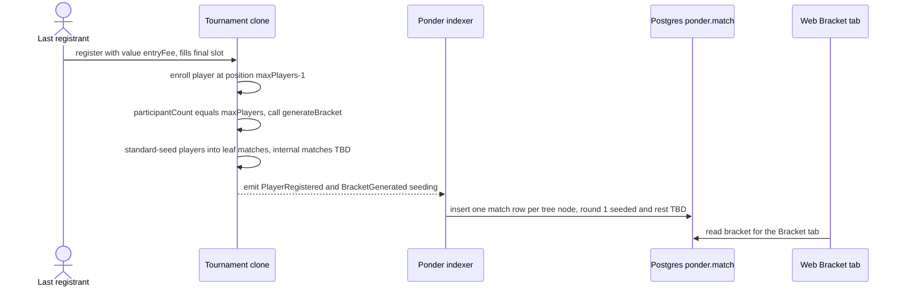

# 006 — Tournament Brackets

> Auto-generate a single-elimination bracket on-chain the moment a tournament
> fills, store it as a binary tree of matches, index it with Ponder, and render
> it on a Bracket tab. This is the structural groundwork for match results and
> judging — result reporting and winner advancement are deferred to spec #007.

## Meta

| Field           | Value                          |
|-----------------|--------------------------------|
| **Status**      | Review                         |
| **Author**      | Ricardo Vinicius               |
| **Created**     | 2026-07-09                     |
| **Updated**     | 2026-07-09                     |
| **Depends on**  | #001 (factory & Tournament clone), #002 (creation wizard + indexer), #004 (details page tabs), #005 (registration & participants) |
| **Supersedes**  | —                              |

> **Successor:** #007 (`007_judge_vote.md`) implements match results, judge
> majority voting, and winner advancement. This spec deliberately stops at
> bracket **generation + storage + display**; every "result", "winner",
> "advancement", "payout", and "cancellation" decision below is scoped out and
> handed to #007 or a later spec.

---

## Problem Statement

A tournament can now be created (#002), configured (#001), and filled with
registered players (#005), but there is no **bracket**: the `Tournament` clone
records a roster in registration order (`_participants`, each player's index is
their seed) yet never pairs anyone up, and the Bracket tab is a
`ComingSoonPanel` placeholder. Without a bracket there is nothing for judges to
rule on and no path to a champion. This feature turns a full roster into a
concrete single-elimination bracket — stored on-chain as a binary tree of
matches, indexed for cheap reads, and drawn on the Bracket tab — so that spec
#007 has a fixed structure to attach results and advancement to.

---

## Goals & Non-Goals

### Goals
- [ ] Generate a single-elimination bracket **automatically** inside the
      `register()` call that fills the final slot (`participantCount == maxPlayers`).
- [ ] Store the bracket on-chain as a fixed-size **binary tree of matches**
      (heap-indexed `Match[]`, the final at index 0), with round-1 matches
      populated by **standard bracket seeding** and later-round slots left `TBD`.
- [ ] Emit a `BracketGenerated` event carrying the seeded leaf ordering so the
      indexer can materialise every match (round 1 + `TBD` ancestors) without an
      on-chain read.
- [ ] Expose on-chain views (`bracketGenerated`, `matchCount`, `getMatches`) for
      trustless reads and for spec #007 to build on.
- [ ] Index bracket matches with Ponder into a `match` table keyed by
      tournament + match index; add a read-only Drizzle mapping.
- [ ] Replace the Bracket `ComingSoonPanel` with a real bracket view: round
      columns (e.g. Quarterfinals -> Semifinals -> Final -> Champion) showing
      round-1 player addresses + seeds and `TBD`/pending placeholders for all
      later slots, plus a clear pre-generation empty state.

### Non-Goals
- **Match results / winner reporting** — no `reportResult`, no winner writes.
  Deferred to #007. The struct reserves a `winner` slot but nothing sets it here.
- **Judge voting** — the design's judge majority-vote flow (screens 6-7) and the
  stored `judges[]` array stay unused this spec. Entirely #007.
- **Winner advancement** — no player moves between rounds; internal (non-leaf)
  matches stay `TBD`. #007 fills them via the index arithmetic documented below.
- **Prize / entry-fee payout** — the design's escrow "auto-release to champion"
  is out of scope; the pot stays in the clone (see #005). Groundwork only for the
  future rule engine.
- **Under-capacity handling / cancellation / refunds** — a tournament that never
  reaches `maxPlayers` before `startDate` **cannot** generate a bracket in this
  spec and is effectively stuck. This is **documented technical debt** (see
  Technical Debt & Future Work); no cancel/refund path ships here.
- **Manual / organizer-triggered generation & re-seeding** — generation is
  strictly automatic on fill. No `generateBracket()` entry point, no organizer
  override, no random seeding. Documented as technical debt.
- **Formats other than single-elimination** — `TournamentFormat` has only
  `SingleElimination`; byes and non-power-of-two fields are impossible by the
  existing `maxPlayers` validation (`>= 2`, power of two).

---

## Proposed Solution

### Overview

A single-elimination bracket **is** a binary tree: each match has two child
matches whose winners feed it, and the final is the root. We store that tree as
a flat, heap-indexed array on the clone — the same trick a binary heap uses —
so parent/child relationships are pure integer arithmetic with no pointers.

Generation is folded into registration: the `register()` call that pushes
`_participants.length` to `maxPlayers` also seeds and writes the bracket in the
same transaction, then emits `BracketGenerated`. Because `maxPlayers` is
validated as a power of two `>= 2` (#001), the field is always exactly full and
**no byes are ever needed**.



On-chain views give trustless, instant reads; the Bracket tab reads the indexed
`match` table (eventually consistent), mirroring the participants roster (#005).

### The binary-tree (heap) model

For a full field of `N = maxPlayers` players there are exactly `N - 1` matches.
We store them in `Match[] _matches` of length `N - 1`, indexed like a binary
heap with the **final at index 0**:

```
                 index 0            round = log2(N)      (FINAL)
                /        \
          index 1        index 2    round = log2(N) - 1  (SEMIFINALS, N=8)
          /     \        /     \
       idx 3  idx 4   idx 5  idx 6  round = 1            (ROUND 1 / leaves)
```

- **Children of match `i`:** `2*i + 1` (left) and `2*i + 2` (right).
- **Parent of match `i`:** `(i - 1) / 2`; the winner of `i` fills the parent's
  `playerA` if `i` is odd (left child), else `playerB`. *(Formula documented for
  #007; not exercised here.)*
- **Round-1 matches (leaves)** are the last `N/2` entries: indices
  `[N/2 - 1 .. N - 2]`. Only these are populated at generation.
- **Round of match `i`:** with `L = floor(log2(i + 1))` the heap level,
  `round = log2(N) - L` (round 1 = first round played, `log2(N)` = final).

Example capacities: `N=2` -> 1 match; `N=4` -> 3; `N=8` -> 7; `N=16` -> 15.

**Seeding.** A player's seed is `position + 1` (registration order from #005;
`position` 0-based). Round-1 pairings use **standard single-elimination
seeding**, which maximally separates top seeds (seed 1 and seed 2 can only meet
in the final). The bracket-slot order is generated recursively:

```
slots = [1]
while len(slots) < N:
    m = 2 * len(slots) + 1          # each seed s pairs with (m - s)
    slots = flatten([[s, m - s] for s in slots])
# N=8 -> [1, 8, 4, 5, 2, 7, 3, 6]
```

Leaf match `k` (`k = 0 .. N/2 - 1`, stored at `_matches[N/2 - 1 + k]`) pairs the
players at seeds `slots[2k]` and `slots[2k+1]` — i.e. `_participants[slots[2k]-1]`
vs `_participants[slots[2k+1]-1]`. Internal matches keep zero-address players
(`TBD`) and a zero `winner`.

> **Does the binary tree "work"?** Yes. The heap layout is the reason to prefer
> it: fixed size known at generation, O(1) parent/child math for #007's
> advancement, no pointers/mappings, and a trivial full-tree render for the UI.
> The cost is `N - 1` storage writes on the filling `register()` tx; `maxPlayers`
> is small and power-of-two-bounded, so this is acceptable (see Business Rules
> note on gas). A leaner "store round 1 only, append later" variant was
> considered and rejected because it complicates #007 (mid-tournament array
> growth) for a marginal one-time gas saving.

### User Experience

**Bracket tab** (replaces `ComingSoonPanel` in `TournamentTabs.tsx`), modeled on
design screen 6 (`docs/design_extracted/.../Tournaments DApp Hi-Fi.dc.html:393`):

- **Pre-generation state** (roster not yet full): an empty state explaining
  "The bracket locks automatically when the tournament fills
  (`X / maxPlayers` registered)." Reuses the participants counter from #005.
- **Generated state**: horizontal round columns labeled by round
  (`Round 1` ... or the conventional `Quarterfinals -> Semifinals -> Final`,
  derived from `maxPlayers`), ending in a **Champion** column:
  - **Round-1 match cards** show both players: shortened address (monospace),
    address-initial avatar placeholder (reuse #005 roster styling), and
    `seed N`.
  - **Later-round match cards** render `TBD` for both slots (no winners exist
    yet this spec).
  - **Champion** slot renders a `?` placeholder.
  - No scores, no "Vote" / "View match" actions — those arrive with #007.

**Edge / empty states**

| Condition | Detection | UI |
|-----------|-----------|-----|
| Roster not full (no bracket) | `bracketGenerated == false` / no `match` rows | Pre-generation empty state + `X / maxPlayers` counter |
| Bracket generated, indexer lagging | `bracketGenerated == true`, rows absent | Skeleton / "Bracket is being indexed" (matches #005 roster lag) |
| Fully generated | `match` rows present | Round columns + `TBD` placeholders |
| Free vs paid / who filled it | n/a | No special UI; generation is a side effect of the last `register()` |

### Data Model

**Indexer — new `match` table** (`apps/indexer/ponder.schema.ts`), one row per
tree node. The indexer materialises **all** `N - 1` nodes from the single
`BracketGenerated` event: round-1 nodes get both players from the seeding array,
internal nodes are written with null players (`TBD`) so the UI can render the
full tree without heap math on the client.

```ts
// apps/indexer/ponder.schema.ts
import { index, onchainTable } from "ponder";

export const match = onchainTable(
  "match",
  (t) => ({
    id: t.text("id").primaryKey(),        // `${tournament}-${matchIndex}` (lowercased)
    tournament: t.hex("tournament").notNull(),
    matchIndex: t.integer("match_index").notNull(), // heap index; 0 = final
    round: t.integer("round").notNull(),  // 1 = first round played; log2(N) = final
    playerA: t.hex("player_a"),           // null = TBD (internal node this spec)
    playerB: t.hex("player_b"),           // null = TBD
    seedA: t.integer("seed_a"),           // 1-based seed; null for TBD
    seedB: t.integer("seed_b"),
    winner: t.hex("winner"),              // always null this spec; set by #007
    blockNumber: t.bigint("block_number").notNull(),
    txHash: t.hex("tx_hash").notNull(),
    generatedAt: t.timestamp("generated_at").notNull(),
  }),
  (table) => ({
    tournamentIdx: index().on(table.tournament), // "all matches of a tournament"
  }),
);
```

**DB — read-only Drizzle mapping** (`packages/db/src/ponderMatch.ts`), following
`ponderTournament.ts` / `ponderRegistration.ts`; the `ponder` schema is owned by
the indexer, so the index is not redeclared and no app migration is required.

```ts
const ponder = pgSchema("ponder");
export const match = ponder.table("match", {
  id: text("id").primaryKey(),
  tournament: text("tournament").notNull(),
  matchIndex: integer("match_index").notNull(),
  round: integer("round").notNull(),
  playerA: text("player_a"),
  playerB: text("player_b"),
  seedA: integer("seed_a"),
  seedB: integer("seed_b"),
  winner: text("winner"),
  blockNumber: numeric("block_number", { precision: 78, scale: 0 }).notNull(),
  txHash: text("tx_hash").notNull(),
  generatedAt: timestamp("generated_at").notNull(),
});
```

### On-chain Interface

Additions to `packages/contracts/contracts/Tournament.sol`.

**Struct**
```solidity
/// @dev One node of the single-elimination binary tree. `winner` is reserved
///      for spec #007 (result reporting) and is always address(0) here.
struct Match {
    address playerA; // address(0) => TBD (internal node, filled by #007)
    address playerB;
    address winner;  // address(0) => unresolved
}
```

**Storage**
```solidity
Match[] private _matches;         // heap-indexed; index 0 = final; length maxPlayers-1
bool public bracketGenerated;     // one-shot latch; true once the field fills
uint64 public bracketGeneratedAt; // block timestamp of generation
```

**Generation (folded into `register()` from #005)** — the enrollment logic is
unchanged; a tail calls the internal generator when the final slot is filled:
```solidity
function register() external payable {
    // ... existing #005 checks + enrollment (isRegistered, _participants.push, event) ...
    if (_participants.length == maxPlayers) {
        _generateBracket();
    }
}

/// @dev Seeds round-1 leaves via standard bracket seeding and reserves internal
///      nodes as TBD. Reachable exactly once, when the field first fills
///      (register() reverts TournamentFull afterwards), so no re-entry guard.
function _generateBracket() private {
    bracketGenerated = true;
    bracketGeneratedAt = uint64(block.timestamp);

    uint32 n = maxPlayers;
    // 1. Pre-size the tree: n-1 matches, all TBD.
    for (uint256 i = 0; i < n - 1; i++) {
        _matches.push(Match(address(0), address(0), address(0)));
    }
    // 2. Compute standard bracket-slot order (seeds) and fill the leaves
    //    [n/2 - 1 .. n - 2] with the seeded player pairs.
    //    (Exact seeding routine is an implementation detail with unit tests.)
    address[] memory seeding = _seedLeaves(); // length n, players in slot order
    for (uint256 k = 0; k < n / 2; k++) {
        Match storage leaf = _matches[n / 2 - 1 + k];
        leaf.playerA = seeding[2 * k];
        leaf.playerB = seeding[2 * k + 1];
    }
    emit BracketGenerated(n, seeding);
}
```

**Views**
```solidity
function matchCount() external view returns (uint256);                 // _matches.length
function getMatches(uint256 offset, uint256 limit)
    external view returns (Match[] memory);                            // clamped, mirrors getParticipants
```

**Event**
```solidity
/// @notice Emitted once, from the register() that fills the final slot.
/// @param playerCount maxPlayers (the full field size, == N).
/// @param seeding     Players in standard bracket-slot order (length N); the
///                    indexer derives every match (round 1 + TBD ancestors).
event BracketGenerated(uint32 playerCount, address[] seeding);
```

**Custom errors** — none new are strictly required: generation is a private side
effect of a valid `register()`, and over-capacity is already blocked by
`TournamentFull` (#005). No `BracketAlreadyGenerated` guard is needed because
`register()` cannot run again once the field is full.

### Frontend Components

| Component / module | Path | Description |
|--------------------|------|-------------|
| `BracketPanel` | `apps/web/src/features/tournaments/components/details/BracketPanel.tsx` | Server component; fetches the bracket and renders the pre-generation empty state or the round columns. Replaces the Bracket `ComingSoonPanel`. |
| `BracketTree` | `apps/web/src/features/tournaments/components/bracket/BracketTree.tsx` | Lays out round columns + Champion column from the match rows. |
| `RoundColumn` | `apps/web/src/features/tournaments/components/bracket/RoundColumn.tsx` | One labeled round of `MatchCard`s. |
| `MatchCard` | `apps/web/src/features/tournaments/components/bracket/MatchCard.tsx` | Two player slots (address + seed) or `TBD` placeholders. No result UI. |
| `getBracket` | `apps/web/src/features/tournaments/server/getBracket.ts` | `listMatches(tournamentAddress)` against `ponder.match`, ordered by `matchIndex`; groups by `round` for the view. |
| `bracketRounds` | `apps/web/src/features/tournaments/lib/bracketRounds.ts` | Pure helper: maps `maxPlayers` + round number to a label (`Final`, `Semifinals`, `Quarterfinals`, else `Round N`) and derives the tree shape. Node-testable. |

Reuse: `formatTournament.ts` (address shortening/labels), the #005 roster
avatar/address styling, `tournamentChainId`, `tournamentAbi`.

### Business Rules
1. **Auto-generation on fill.** The bracket is generated exactly once, as a side
   effect of the `register()` that makes `participantCount == maxPlayers`. There
   is no separate entry point and no organizer action.
2. **Full field only.** Generation requires a full power-of-two field; byes are
   impossible. A tournament that does not fill before `startDate` never generates
   a bracket (technical debt — no cancel/refund this spec).
3. **Seed = registration order.** A player's seed is `position + 1` from #005;
   round-1 pairings use standard bracket seeding (1 vs N, 2 vs N-1, ...).
4. **Binary-tree storage.** Matches live in a heap-indexed `Match[]` of length
   `maxPlayers - 1`, final at index 0; only round-1 leaves are populated, the
   rest are `TBD` for #007. Gas: generation performs `O(maxPlayers)` storage
   writes on the filling tx — acceptable given the power-of-two capacity bound.
5. **No results here.** `winner` is always `address(0)`; internal matches stay
   `TBD`. Reporting, voting, and advancement are spec #007.
6. **On-chain is truth; indexer is the view.** `bracketGenerated` / `getMatches`
   are authoritative; the Bracket tab reads the eventually-consistent `match`
   table.

---

## Implementation Plan

### Contracts (`packages/contracts`)
1. `contracts/Tournament.sol`: add the `Match` struct, `_matches` /
   `bracketGenerated` / `bracketGeneratedAt` storage, the `BracketGenerated`
   event, the `register()` generation tail, `_generateBracket()` + the private
   seeding helper, and `matchCount()` / `getMatches(offset, limit)` views.
2. `contracts/Tournament.t.sol`: forge unit tests (see Testing).
3. `test/Tournament.ts`: extend the viem integration test to fill a tournament
   and assert `BracketGenerated` args + `getMatches` pairings/ordering.
4. `pnpm --filter @arbiter/contracts build` to recompile and regenerate
   `src/generated/abi.ts` (never hand-edit); confirm `BracketGenerated`,
   `getMatches`, `matchCount`, `bracketGenerated` appear in `tournamentAbi`.

### Indexer (`apps/indexer`)
1. `ponder.schema.ts`: add the `match` table.
2. `src/toMatchRows.ts`: pure decoder turning one `BracketGenerated` event into
   `N - 1` match rows — round-1 rows from `seeding` (with seeds), internal rows
   as `TBD`, `round`/`matchIndex` from the heap arithmetic above.
3. `src/index.ts`: `ponder.on("Tournament:BracketGenerated", ...)` inserting the
   rows (`context.db.insert(match).values(rows)`), ids `${tournament}-${index}`
   lowercased, `generatedAt` from block timestamp.

### DB (`packages/db`)
1. Add `src/ponderMatch.ts` mapping the read-only `ponder.match` table; export
   types and re-export from the package index. No Drizzle migration.

### Frontend (`apps/web`)
1. `server/getBracket.ts`: `listMatches(tournamentAddress)` ordered by
   `matchIndex`.
2. `lib/bracketRounds.ts`: round-label + tree-shape helper (pure, tested).
3. `components/bracket/{BracketTree,RoundColumn,MatchCard}.tsx` +
   `components/details/BracketPanel.tsx`.
4. Replace the Bracket `ComingSoonPanel` in `TournamentTabs.tsx` /
   `TournamentDetails.tsx` with `BracketPanel`.

### Migrations
- None (app-owned schema unchanged). `ponder.match` is created by the indexer on
  startup; document a fresh indexer sync for tournaments generated before this
  handler existed.

---

## Testing Strategy

### Contract Tests (forge, `Tournament.t.sol`)
- **Auto-gen on fill**: registering the `maxPlayers`-th player sets
  `bracketGenerated`, sets `bracketGeneratedAt`, and `matchCount == maxPlayers-1`.
- **Not before full**: with `participantCount < maxPlayers`, `bracketGenerated`
  is false and `matchCount == 0`.
- **Seeding correctness**: for `N = 2, 4, 8`, assert the leaf matches
  (`_matches[N/2-1 .. N-2]`) pair the expected seeds (e.g. `N=8` ->
  `1v8, 4v5, 2v7, 3v6`) and internal matches are all-`TBD`.
- **Tree shape**: `getMatches` returns `N-1` entries, index 0 (final) is `TBD`,
  `getMatches(offset, limit)` clamps like `getParticipants`.
- **Event**: `vm.expectEmit` on `BracketGenerated(maxPlayers, seeding)` with the
  seeding array in standard slot order.
- **No over-run**: a further `register()` after full still reverts
  `TournamentFull` (generation is not re-entered).

### Integration Tests (viem, `test/Tournament.ts`)
- Fill an 8-player tournament from wallet clients; assert `BracketGenerated`
  args (`viem.assertions.emitWithArgs`) and that `getMatches` leaf pairings match
  the seeded order.

### Indexer Tests
- `toMatchRows`: given a `BracketGenerated(8, seeding)` event, produces 7 rows —
  4 round-1 rows with correct `matchIndex`/`round`/players/seeds and 3 `TBD`
  internal rows — with ids `${tournament}-${index}` lowercased.

### Frontend Tests
- `bracketRounds`: round-label + shape derivation for `N = 2, 4, 8, 16` (named
  fake data, not inline stubs).
- `BracketPanel`: renders the pre-generation empty state when no rows; renders
  round columns with seeded round-1 cards and `TBD` placeholders from a fake
  `listMatches`.

### Manual Verification
1. `pnpm build`; start chain + indexer + web.
2. Create an 8-player tournament; register 8 wallets. On the 8th tx, confirm the
   Bracket tab flips from the empty state to a full bracket (4 seeded round-1
   matches, `TBD` semis/final, `?` champion) after the indexer catches up.
3. Confirm a 9th `register()` reverts `TournamentFull` and the bracket is
   unchanged.

---

## Open Questions

> All resolved (see Decision Log). None block implementation.

---

## Decision Log

| Date | Decision | Rationale |
|------|----------|-----------|
| 2026-07-09 | Match results / judge voting / advancement **out of scope**; deferred to #007 | Keeps this spec to structure only; #007 (`007_judge_vote.md`) owns the judge majority-vote flow the design shows. |
| 2026-07-09 | **Require a full field** to generate (no byes) | `maxPlayers` is already validated power-of-two `>= 2`; a full field needs no bye logic. Underfill handling is deferred tech debt. |
| 2026-07-09 | **Auto-generate on fill**, inside the filling `register()`; no organizer/startDate trigger | Matches the draft's "after the last player registers"; the `startDate`-not-full path is deferred tech debt. |
| 2026-07-09 | **Binary tree as a heap-indexed `Match[]`**, final at index 0, full skeleton pre-sized | O(1) parent/child math for #007 advancement, no pointers, trivial full-tree render; one-time `O(maxPlayers)` write cost is acceptable. |
| 2026-07-09 | **Standard bracket seeding** (1 vs N, 2 vs N-1, ...) from registration order | Deterministic and matches the design (seed 1 & 4 meeting in a semifinal); fairness is moot since order is arrival-based. |
| 2026-07-09 | **Prize/entry-fee payout out of scope** | Groundwork for the future rule engine; escrow release stays a later spec (consistent with #005). |
| 2026-07-09 | Bracket view = **matchups + TBD placeholders** | Renders the full multi-round tree now; result-bearing cards (scores/vote) arrive with #007. |
| 2026-07-09 | Indexer materialises **all** tree nodes from one `BracketGenerated(seeding)` event | Single event, no on-chain read in the handler; UI renders `TBD` ancestors without client-side heap math. |

---

## Technical Debt & Future Work

> Explicitly acknowledged gaps this spec leaves open. None are bugs; each is a
> conscious deferral requested during review.

1. **Underfilled tournaments are stuck.** If `participantCount < maxPlayers` when
   `startDate` passes, no bracket can ever generate and entry fees stay locked. A
   future spec needs a **cancellation path** (organizer- or permissionless-
   triggered after `startDate`) plus **entry-fee refunds** and prize return.
2. **No manual generation / advanced lifecycle management.** Generation is purely
   automatic on fill. A future spec should consider organizer-triggered
   generation, re-seeding, and richer state management (e.g. generate a smaller
   bracket from partial registration, or extend the registration window).
3. **Results, judging, advancement, payout** — all owned by #007 and the future
   rule engine (judge majority vote, winner writes into parent nodes via the
   documented index arithmetic, escrow release to the champion).
4. **Generation gas.** `O(maxPlayers)` storage writes ride on one unlucky
   registrant's tx. Acceptable at current capacities; revisit (lazy internal-node
   creation, or keeper-triggered generation) if large fields are supported.

---

## References
- Draft notes (original `006_brackets.md`).
- Design: `docs/design_extracted/prot-tipos-dapp-torneios-web3/project/Tournaments DApp Hi-Fi.dc.html`
  — screen 6 "Tournament view — bracket + match panel" (line ~393) and screen 7
  "Judge — vote on a match" (line ~463, informs #007).
- Prior specs: #001 (`Tournament`/factory, `maxPlayers` power-of-two validation),
  #002 (indexer + wizard), #004 (details page tabs), #005 (registration,
  `_participants` order = seed, Ponder factory pattern, roster UI).
- Successor: #007 (`007_judge_vote.md`) — match results & judge majority voting.
- Patterns to mirror: `apps/indexer/ponder.schema.ts` + `src/toRegistrationRow.ts`,
  `packages/db/src/ponderRegistration.ts`, `apps/web/.../server/getRegistrations.ts`,
  `apps/web/.../components/details/ParticipantsPanel.tsx`.
