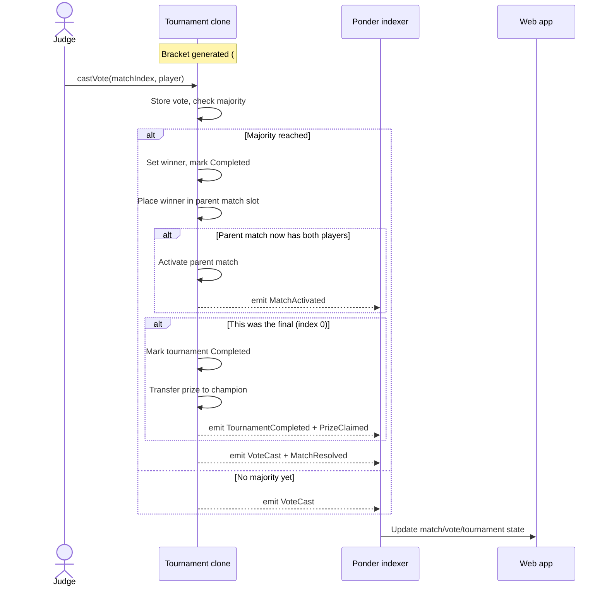
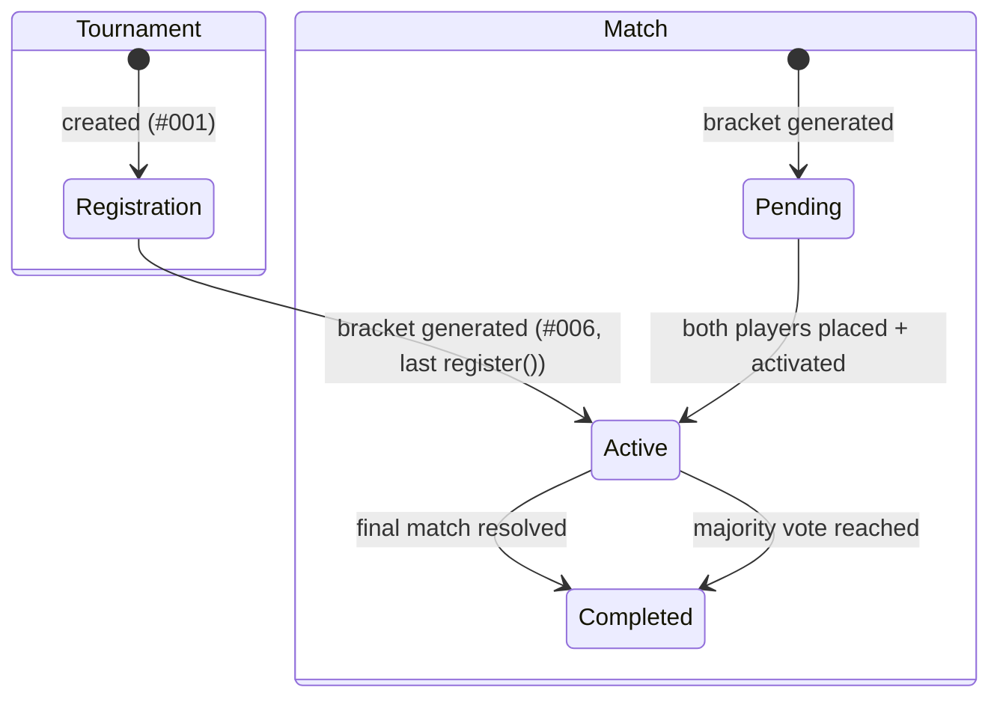

# 007 — Judge Voting, Match Resolution & Tournament Engine

> Judges cast on-chain votes to decide match winners; votes auto-resolve by
> majority; winners advance through the bracket; the champion receives the prize
> via push-payout; the organizer withdraws accumulated entry fees. This is the
> engine that turns a static bracket (#006) into a running tournament with a
> verifiable outcome.

## Meta

| Field           | Value                          |
|-----------------|--------------------------------|
| **Status**      | Draft                          |
| **Author**      | Ricardo Vinicius               |
| **Created**     | 2026-07-09                     |
| **Updated**     | 2026-07-09                     |
| **Depends on**  | #001 (factory & Tournament clone), #005 (registration), #006 (bracket generation & binary-tree `Match[]`) |
| **Supersedes**  | \u2014                              |

---

## Problem Statement

Spec #006 generates a single-elimination bracket and stores it as a heap-indexed
binary tree of `Match` structs, but every match stays unresolved: no one can
vote, no winner is ever recorded, no player advances, and no prize is paid out.
The tournament is structurally complete but operationally dead.

This spec closes the loop by implementing the **tournament engine**: the
on-chain judge voting mechanism, automatic match resolution by majority,
bracket advancement via the heap\u2019s index arithmetic, tournament completion
detection, push-pattern prize distribution to the champion, organizer entry-fee
withdrawal, event indexing for all new state transitions, and the full frontend
UI for judges (vote casting), spectators (vote tracking), and organizers
(tournament lifecycle).

**Who is affected:**
- **Judges** \u2014 need a way to cast and view votes on active matches.
- **Players** \u2014 need to see match results and bracket progression.
- **Organizers** \u2014 need the tournament to reach completion so they can withdraw
  entry fees.
- **The champion** \u2014 needs to receive the deposited prize automatically.

---

## Goals & Non-Goals

### Goals
- [ ] Allow authorized judges to cast an **immutable, public, on-chain vote**
      selecting one of the two players in an active match.
- [ ] **Auto-resolve** a match as soon as a strict majority of judges have voted
      for the same player (no organizer action required).
- [ ] On resolution, **automatically advance** the winner into the correct slot
      of the parent match using the heap\u2019s index arithmetic from #006.
- [ ] When both slots of a parent match are filled, **auto-activate** that match
      (set status to `Active`) so judges can vote on it immediately.
- [ ] **Auto-activate all round-1 matches** when the bracket is generated (tournament
      starts on fill).
- [ ] Detect the **tournament\u2019s completion** when the final match (index 0)
      resolves, and automatically **push the prize** to the champion.
- [ ] Allow the organizer to **withdraw accumulated entry fees** after the
      tournament completes.
- [ ] Emit events for all state transitions (`VoteCast`, `MatchResolved`,
      `MatchActivated`, `TournamentCompleted`, `PrizeClaimed`, `FeesWithdrawn`)
      and **index them with Ponder**.
- [ ] Build the **judge voting UI** (design screen 7) and the **match detail
      panel** (design screen 6 sidebar) following the design reference.
- [ ] Display **real-time public vote breakdown** (which judge voted for whom)
      for all viewers.

### Non-Goals
- **Changing votes.** A judge\u2019s vote is immutable once cast. No update or
  retraction mechanism.
- **Forfeit / no-show / disqualification.** Every match must be decided by judge
  votes. No forfeit path ships in this spec.
- **Mid-tournament cancellation.** Once the bracket generates and matches start,
  the tournament cannot be cancelled. Cancellation before fill is deferred.
- **Tournament formats other than single-elimination.** Only the existing
  `SingleElimination` format is supported.
- **Configurable prize splits.** Winner takes all (100% of organizer-deposited
  prize). Multi-place splits are future work.
- **Per-match judge assignment.** The same judge panel votes on every match.
- **Judge panel modification after creation.** Judges are fixed at tournament
  creation (#001) and cannot be changed.
- **Platform fee.** No Arbiter platform cut. Entry fees go entirely to the
  organizer; the prize goes entirely to the champion.
- **Organizer-as-judge conflict prevention.** The organizer is allowed to also
  be a judge if they choose.

---

## Proposed Solution

### Overview

The engine operates as a **state machine** driven entirely by judge votes. No
organizer intervention is required after the bracket generates. The flow:



### Tournament & Match Lifecycle



**Tournament status** (`TournamentStatus` enum, new):
- `Registration` \u2014 accepting players (default after `initialize`).
- `Active` \u2014 bracket generated, matches in progress. Set automatically by #006\u2019s
  `_generateBracket()` tail.
- `Completed` \u2014 final match resolved, prize paid, organizer can withdraw fees.

**Match status** (`MatchStatus` enum, new):
- `Pending` \u2014 not yet playable (one or both player slots are TBD).
- `Active` \u2014 both players set, judges can vote.
- `Completed` \u2014 winner determined by majority vote.

### Voting Mechanics

1. **Eligibility.** Only addresses in the tournament\u2019s `_judges[]` array (set at
   creation, #001) may call `castVote`. The same judges vote on every match.

2. **Vote casting.** `castVote(uint256 matchIndex, address player)`:
   - Match must be `Active`.
   - Caller must be an authorized judge.
   - Caller must not have already voted on this match.
   - `player` must be either `playerA` or `playerB` of the match.
   - The vote is stored in a `mapping(address => address)` on the match and is
     **immutable** \u2014 no update or retraction.
   - Emits `VoteCast(matchIndex, judge, votedFor)`.

3. **Auto-resolution.** After each vote, the contract checks whether a **strict
   majority** (more than half of the total judge count) has been reached for
   either player. With an odd judge count (enforced at creation, see Business
   Rules), a tie is impossible.

   - If `votesForPlayerA > judgeCount / 2` \u2192 playerA wins.
   - If `votesForPlayerB > judgeCount / 2` \u2192 playerB wins.
   - Resolution is **automatic** within the same `castVote` transaction \u2014 no
     separate `resolveMatch()` call.

4. **Odd judge count enforcement.** The `_storeJudges` function (#001) is
   extended to require `judges.length` is odd and `>= 1`. This guarantees a
   majority is always achievable without a tiebreaker.

### Bracket Advancement

When a match at heap index `i` resolves with winner `w`:

1. **Set** `_matches[i].winner = w` and `_matches[i].status = Completed`.
2. **If `i == 0`** (the final): trigger tournament completion (see below).
3. **Otherwise**, compute the parent index: `parentIndex = (i - 1) / 2`.
   - If `i` is **odd** (left child): `_matches[parentIndex].playerA = w`.
   - If `i` is **even** (right child): `_matches[parentIndex].playerB = w`.
4. **Check the parent**: if both `playerA` and `playerB` are now non-zero, set
   `_matches[parentIndex].status = Active` and emit `MatchActivated`.

This is pure integer arithmetic on the heap layout from #006 \u2014 no pointers,
no mappings, no loops.

### Tournament Completion & Prize Distribution

When the final match (index 0) resolves:

1. `_matches[0].winner` is set to the champion\u2019s address.
2. `status` is set to `TournamentStatus.Completed`.
3. The contract\u2019s `prize` amount is **pushed** (transferred) to the champion
   via a low-level `call{value: prize}`. This happens atomically in the same
   transaction as the resolving `castVote`.
4. Emits `TournamentCompleted(champion)` and `PrizeClaimed(champion, prize)`.
5. **Re-entrancy guard:** the prize transfer uses the checks-effects-interactions
   pattern (state updated before the external call) plus OpenZeppelin\u2019s
   `ReentrancyGuard`.

### Entry Fee Withdrawal

After `status == Completed`, the organizer may call `withdrawFees()`:
- Transfers the entire contract balance (which at that point equals
  `entryFee * maxPlayers`, since `prize` was already sent to the champion) to
  the organizer.
- Emits `FeesWithdrawn(organizer, amount)`.
- Can only be called once (balance becomes 0).

### User Experience

#### Judge Voting Screen (Design Screen 7)

Accessed by clicking a match card from the Bracket tab, or via the "Vote now"
CTA on the tournament card in "My Tournaments."

**Layout:**
- **Breadcrumb:** `Tournament Name > Round Name > Match N`
- **Badge:** `YOU ARE JUDGE` (secondary variant) in the top bar when the
  connected wallet is in the judges array.
- **Title:** "Who won this match?"
- **Vote progress:** `X / Y voted \u00b7 majority needed` with pip indicators (filled
  for cast votes, empty for pending).
- **Two player cards** side by side, each showing:
  - Avatar placeholder (address-initial, reuse #005 styling).
  - Display name (from off-chain metadata if available) or shortened address.
  - Full address in monospace + seed number.
  - Submission/result screenshot area (placeholder this spec; future feature).
  - **"Pick as winner"** button (outline) / **"Selected as winner"** button
    (lime, with checkmark) for the selected player.
- **Optional comment field:** "Reason for decision\u2026" (off-chain, stored in
  tournament metadata / DB, not on-chain).
- **"Submit vote & sign"** CTA (lime) \u2014 triggers the wallet transaction.
- **Footer note:** "Your vote is recorded on-chain. The match resolves
  automatically once a majority agrees."

**States:**
- **Judge hasn\u2019t voted yet:** Both cards show "Pick as winner" buttons. Comment
  field visible. Submit CTA enabled after selection.
- **Judge has voted:** Their selection is highlighted (lime border + checkmark).
  "Submit vote & sign" replaced with "Vote submitted" (disabled). Comment field
  becomes read-only if a comment was provided.
- **Match resolved:** Both cards show final result. Winner card has a lime left
  border. "Decided by majority" status. No vote buttons.

#### Match Detail Panel (Design Screen 6 Sidebar)

Shown in a right sidebar when clicking a match card on the Bracket tab:

- **Status badge:** `SF \u00b7 LIVE` (lime) / `Completed` / `Pending`.
- **"awaiting judges"** subtitle when votes are pending.
- **Two player cards** (compact: avatar + name + address + seed).
- **Judge votes section:** "Judge votes \u00b7 majority of N"
  - Each judge shown as a row: address (mono) + their vote (player name or
    "pending\u2026").
  - Votes are **fully public in real-time** as they are cast.
- **"View submissions"** button (placeholder for future match evidence feature).

#### My Tournaments \u2014 Judge Card

Tournament cards where the connected wallet is a judge show:
- `JUDGE` badge (secondary variant).
- Subtitle: "X matches need your vote."
- **"Vote now"** CTA (lime) linking to the first unvoted active match.

#### Bracket Tab Enhancements

- **Completed match cards** show winner with lime left-border accent and the
  score as vote count (e.g., `2` votes for winner vs `1` for loser).
- **Active match cards** show both players with a lime glow border indicating
  the match is live.
- **Champion slot** shows the winner\u2019s address (or name) + prize amount when
  the tournament completes. `?` placeholder until then.

### Data Model

#### On-chain additions to `Match` struct

```solidity
enum MatchStatus { Pending, Active, Completed }
enum TournamentStatus { Registration, Active, Completed }

struct Match {
    address playerA;    // from #006
    address playerB;    // from #006
    address winner;     // set by this spec on resolution
    MatchStatus status; // new: Pending -> Active -> Completed
    uint8 voteCount;    // total votes cast on this match
    // Per-match vote storage lives in a separate mapping (see below)
}
```

The per-match vote mapping is stored outside the struct to avoid Solidity\u2019s
restriction on mappings inside structs used in arrays:

```solidity
// matchIndex => judge address => voted-for address
mapping(uint256 => mapping(address => address)) private _votes;
// matchIndex => player address => vote count for that player
mapping(uint256 => mapping(address => uint8)) private _votesFor;
```

#### Indexer \u2014 new tables (`apps/indexer/ponder.schema.ts`)

**`vote` table:**
```ts
export const vote = onchainTable(
  "vote",
  (t) => ({
    id: t.text("id").primaryKey(),       // `${tournament}-${matchIndex}-${judge}`
    tournament: t.hex("tournament").notNull(),
    matchIndex: t.integer("match_index").notNull(),
    judge: t.hex("judge").notNull(),
    votedFor: t.hex("voted_for").notNull(),
    blockNumber: t.bigint("block_number").notNull(),
    txHash: t.hex("tx_hash").notNull(),
    votedAt: t.timestamp("voted_at").notNull(),
  }),
  (table) => ({
    matchIdx: index().on(table.tournament, table.matchIndex),
  }),
);
```

**Updates to existing `match` table** (from #006):
- The indexer updates `winner`, `status` (add to schema if absent) on
  `MatchResolved` events.
- Adds `playerA` / `playerB` updates on `MatchActivated` for parent matches
  that transition from TBD.

**`tournament_result` table** (or update existing tournament row):
```ts
// Optionally, index tournament completion into the existing ponder.tournament
// table by adding `champion`, `completedAt` columns, updated on
// TournamentCompleted events.
```

#### DB \u2014 read-only Drizzle mappings (`packages/db`)

**`ponderVote.ts`:**
```ts
const ponder = pgSchema("ponder");
export const vote = ponder.table("vote", {
  id: text("id").primaryKey(),
  tournament: text("tournament").notNull(),
  matchIndex: integer("match_index").notNull(),
  judge: text("judge").notNull(),
  votedFor: text("voted_for").notNull(),
  blockNumber: numeric("block_number", { precision: 78, scale: 0 }).notNull(),
  txHash: text("tx_hash").notNull(),
  votedAt: timestamp("voted_at").notNull(),
});
```

### On-chain Interface

#### New State Variables

```solidity
TournamentStatus public status;  // Registration -> Active -> Completed

// Vote storage (outside Match struct to allow mappings)
mapping(uint256 => mapping(address => address)) private _votes;
mapping(uint256 => mapping(address => uint8)) private _votesFor;
```

#### New / Modified Functions

| Function | Signature | Mutability | Description |
|----------|-----------|-----------|-------------|
| `castVote` | `(uint256 matchIndex, address player)` | external | Judge casts immutable vote; auto-resolves on majority; auto-advances winner; auto-completes tournament on final. |
| `withdrawFees` | `()` | external | Organizer withdraws entry fees after tournament completion. |
| `getVote` | `(uint256 matchIndex, address judge)` | external view | Returns who a judge voted for (`address(0)` if not voted). |
| `getVotesFor` | `(uint256 matchIndex, address player)` | external view | Returns vote count for a player in a match. |
| `champion` | `()` | external view | Returns the champion\u2019s address (alias for `_matches[0].winner`). |

**Modified `_generateBracket()`** (from #006): after generating the bracket,
sets `status = TournamentStatus.Active` and activates all round-1 matches
(leaf nodes `[N/2-1 .. N-2]`) by setting their status to `MatchStatus.Active`.
Emits `MatchActivated` for each.

**Modified `_storeJudges()`** (from #001): adds validation that
`judges.length` is odd and `>= 1`.

#### New Events

```solidity
event VoteCast(
    uint256 indexed matchIndex,
    address indexed judge,
    address indexed votedFor
);

event MatchResolved(
    uint256 indexed matchIndex,
    address indexed winner,
    uint8 votesForWinner,
    uint8 totalVotes
);

event MatchActivated(uint256 indexed matchIndex);

event TournamentCompleted(address indexed champion);

event PrizeClaimed(address indexed champion, uint256 amount);

event FeesWithdrawn(address indexed organizer, uint256 amount);
```

#### Custom Errors

```solidity
error NotJudge(address caller);
error MatchNotActive(uint256 matchIndex, MatchStatus current);
error AlreadyVoted(uint256 matchIndex, address judge);
error InvalidVoteTarget(uint256 matchIndex, address player);
error InvalidMatchIndex(uint256 matchIndex, uint256 matchCount);
error TournamentNotCompleted(TournamentStatus current);
error NotOrganizer(address caller);
error NoFeesToWithdraw();
error OddJudgeCountRequired(uint256 provided);
error EmptyJudgeArray();
error PrizeTransferFailed(address champion, uint256 amount);
error FeeTransferFailed(address organizer, uint256 amount);
```

### Frontend Components

| Component / Module | Path | Description |
|--------------------|------|-------------|
| `JudgeVoteScreen` | `features/tournaments/components/judge/JudgeVoteScreen.tsx` | Full-page judge voting view (design screen 7). Player cards, vote selection, comment, submit CTA. |
| `PlayerVoteCard` | `features/tournaments/components/judge/PlayerVoteCard.tsx` | One player\u2019s card with avatar, name, address, seed, submission area, pick/selected button. |
| `VoteProgress` | `features/tournaments/components/judge/VoteProgress.tsx` | `X/Y voted \u00b7 majority needed` with pip indicators. |
| `MatchPanel` | `features/tournaments/components/bracket/MatchPanel.tsx` | Right sidebar on bracket tab showing match detail + judge vote breakdown (design screen 6 sidebar). |
| `JudgeVoteList` | `features/tournaments/components/bracket/JudgeVoteList.tsx` | List of judges with their vote status (voted-for or pending). |
| `WithdrawFeesButton` | `features/tournaments/components/details/WithdrawFeesButton.tsx` | Button for organizer to withdraw entry fees (visible only after completion). |
| `ChampionDisplay` | `features/tournaments/components/bracket/ChampionDisplay.tsx` | Champion slot in bracket view: shows winner + prize when completed. |
| `useCastVote` | `features/tournaments/hooks/useCastVote.ts` | Wagmi hook wrapping `castVote` contract write. |
| `useMatchVotes` | `features/tournaments/hooks/useMatchVotes.ts` | Reads vote data for a match (all judges + their votes). |
| `useWithdrawFees` | `features/tournaments/hooks/useWithdrawFees.ts` | Wagmi hook wrapping `withdrawFees` contract write. |
| `getMatchVotes` | `features/tournaments/server/getMatchVotes.ts` | Server function querying `ponder.vote` for a match. |
| `getTournamentResult` | `features/tournaments/server/getTournamentResult.ts` | Server function querying champion + completion status. |

### Business Rules

1. **Immutable votes.** Once a judge casts a vote, it cannot be changed or
   retracted. The contract enforces this via the `AlreadyVoted` error.

2. **Odd judge count \u2265 1.** Enforced at tournament creation. This guarantees a
   strict majority is always achievable (no ties possible). Existing validation
   in `_storeJudges` is extended.

3. **Same judges for all matches.** The `_judges[]` array set at creation is used
   for every match in the tournament. No per-match assignment.

4. **Public votes.** All votes are visible on-chain and in the UI in real-time
   as they are cast. There is no sealed-vote mechanism.

5. **Auto-resolution on majority.** The `castVote` function checks for majority
   after every vote. With `J` judges (odd), majority = `(J / 2) + 1` (integer
   division). Resolution happens atomically in the same transaction.

6. **Automatic bracket advancement.** On resolution, the winner is placed in the
   parent match via heap index arithmetic. No manual `advanceWinner()` call.

7. **Auto-activation of next-round matches.** When both player slots of a match
   are filled by advancement, it is automatically set to `Active`.

8. **Auto-activation of round-1 matches.** All leaf matches are activated as
   part of bracket generation, since both players are known.

9. **Push-pattern prize payout.** The prize is transferred to the champion in the
   same transaction that resolves the final match. No `claimPrize()` required.
   Re-entrancy is guarded.

10. **Entry fees to organizer.** Entry fees are a separate pool from the prize.
    The organizer withdraws them via `withdrawFees()` after tournament completion.
    The full balance (`entryFee * maxParticipants`) is transferred.

11. **No cancellation after start.** Once `status == Active` (bracket generated),
    the tournament cannot be cancelled. All matches must be resolved by judge vote.

12. **No forfeit / no-show.** Judges must vote on every match. If a player
    doesn\u2019t show up, judges still decide the match outcome.

13. **Organizer may be a judge.** No conflict-of-interest restriction. The
    organizer\u2019s address is allowed in the `_judges[]` array.

14. **Power-of-two participants only.** Inherited from #001/#006. No byes.

---

## Implementation Plan

### Contracts (`packages/contracts`)

1. **`contracts/Tournament.sol`:**
   - Add `TournamentStatus` and `MatchStatus` enums.
   - Add `status` state variable (default `Registration`).
   - Add `_votes` and `_votesFor` mappings.
   - Add all custom errors listed above.
   - Add all events listed above.
   - Modify `_storeJudges()` to require odd count \u2265 1.
   - Modify `_generateBracket()` to set `status = Active` and activate round-1
     matches.
   - Implement `castVote()` with:
     - Authorization checks (judge, match active, not voted, valid target).
     - Vote storage.
     - Majority detection.
     - `_resolveMatch()` internal call on majority.
   - Implement `_resolveMatch()` internal:
     - Set winner and status.
     - If not final: advance winner to parent, check/activate parent.
     - If final: complete tournament, transfer prize.
   - Implement `withdrawFees()`.
   - Implement view functions: `getVote`, `getVotesFor`, `champion`.
   - Add `ReentrancyGuard` (OpenZeppelin) for `castVote` and `withdrawFees`.

2. **`contracts/Tournament.t.sol`:** Forge tests (see Testing).

3. **`test/Tournament.ts`:** Viem integration tests (see Testing).

4. **Rebuild:** `pnpm --filter @arbiter/contracts build` to regenerate ABI.

### Indexer (`apps/indexer`)

1. **`ponder.schema.ts`:** Add `vote` table. Add `status` column to `match` if
   not present. Add `champion`/`completedAt` to `tournament` if desired.

2. **`src/toVoteRow.ts`:** Pure helper: `VoteCast` event \u2192 vote row.

3. **`src/index.ts`:** Add handlers:
   - `Tournament:VoteCast` \u2192 insert into `vote`.
   - `Tournament:MatchResolved` \u2192 update `match` row (`winner`, `status`).
   - `Tournament:MatchActivated` \u2192 update `match` row (`status`, `playerA`/
     `playerB` if parent advancement).
   - `Tournament:TournamentCompleted` \u2192 update `tournament` row.

### DB (`packages/db`)

1. **`src/ponderVote.ts`:** Read-only Drizzle mapping for `ponder.vote`.
2. **Update `src/index.ts`:** Re-export new types.
3. No Drizzle migration (Ponder-owned tables).

### Frontend (`apps/web`)

1. **Hooks:** `useCastVote.ts`, `useMatchVotes.ts`, `useWithdrawFees.ts`.
2. **Server functions:** `getMatchVotes.ts`, `getTournamentResult.ts`.
3. **Judge components:** `JudgeVoteScreen.tsx`, `PlayerVoteCard.tsx`,
   `VoteProgress.tsx`.
4. **Bracket enhancements:** `MatchPanel.tsx` (sidebar), `JudgeVoteList.tsx`,
   `ChampionDisplay.tsx`. Update `MatchCard.tsx` to show winner/active states.
5. **Tournament details:** `WithdrawFeesButton.tsx` (organizer-only after
   completion).
6. **Routing:** Add `/tournaments/[address]/matches/[matchIndex]/vote` route
   for the judge voting screen.
7. **My Tournaments:** Update `TournamentCard.tsx` to show judge-specific
   info ("X matches need your vote", "Vote now" CTA).

### Migrations
- None (app-owned schema unchanged). Ponder tables are created by the indexer.
  A fresh indexer sync is required for tournaments created before this handler.

---

## Testing Strategy

### Contract Tests (Forge, `Tournament.t.sol`)

- **Vote casting:**
  - Only authorized judges can vote (`NotJudge` revert for non-judges).
  - Cannot vote on non-active matches (`MatchNotActive` revert).
  - Cannot vote twice on the same match (`AlreadyVoted` revert).
  - Cannot vote for an address that is neither playerA nor playerB
    (`InvalidVoteTarget` revert).
  - Valid vote increments `voteCount` and stores the vote.
  - `VoteCast` event is emitted with correct args.

- **Auto-resolution:**
  - With 3 judges: 2 votes for the same player triggers resolution.
  - With 1 judge: 1 vote triggers resolution.
  - With 5 judges: 3 votes for the same player triggers resolution.
  - Winner is correctly set on the match.
  - `MatchResolved` event is emitted.

- **Bracket advancement:**
  - Resolving a round-1 match places the winner in the parent match\u2019s correct
    slot (`playerA` if left child, `playerB` if right child).
  - Parent match transitions to `Active` when both slots are filled.
  - `MatchActivated` event is emitted for the parent.

- **Tournament completion:**
  - Resolving the final match (index 0) sets `status = Completed`.
  - Prize is transferred to the champion.
  - `TournamentCompleted` and `PrizeClaimed` events are emitted.
  - `champion()` returns the correct address.

- **Full tournament flow (N=4):**
  - Create with 3 judges, fill with 4 players.
  - Vote on both round-1 matches (2 of 3 judges each).
  - Verify winners advance to the final.
  - Vote on the final. Verify champion, prize transfer, tournament completion.

- **Fee withdrawal:**
  - Only organizer can call (`NotOrganizer` revert).
  - Only after completion (`TournamentNotCompleted` revert).
  - Correct amount transferred (`entryFee * maxPlayers`).
  - Second call reverts (`NoFeesToWithdraw`).
  - `FeesWithdrawn` event emitted.

- **Odd judge enforcement:**
  - Creating with 0 judges reverts `EmptyJudgeArray`.
  - Creating with 2 judges reverts `OddJudgeCountRequired`.
  - Creating with 1, 3, 5 judges succeeds.

- **Round-1 auto-activation:**
  - After bracket generation, all leaf matches have `status == Active`.
  - `MatchActivated` events are emitted.

### Integration Tests (Viem, `test/Tournament.ts`)

- Full 8-player tournament lifecycle: create \u2192 register \u2192 vote round 1 \u2192
  vote semis \u2192 vote final \u2192 verify champion + prize + fee withdrawal.
- Assert all events emitted with correct parameters.
- Verify balance changes (prize to champion, fees to organizer).

### Indexer Tests

- `toVoteRow`: given a `VoteCast` event, produces a correctly keyed row.
- Match update on `MatchResolved`: winner and status fields updated.
- Tournament update on `TournamentCompleted`: champion set.

### Frontend Tests

- `JudgeVoteScreen`: renders player cards, vote buttons for judges; shows
  "Vote submitted" for already-voted judges; shows resolved state for completed
  matches.
- `VoteProgress`: correct pip rendering for various vote counts.
- `MatchPanel`: shows judge vote breakdown with correct status per judge.
- `ChampionDisplay`: shows placeholder pre-completion, champion post-completion.

### Manual Verification

1. `pnpm build`; start chain + indexer + web.
2. Create a tournament with 3 judges (odd), 4 max players.
3. Register 4 players (bracket auto-generates, round-1 matches auto-activate).
4. As judge 1: cast vote on match 1. Verify vote appears in UI in real-time.
5. As judge 2: cast vote on match 1 for the same player. Verify auto-resolution,
   winner shown, bracket advancement visible.
6. Repeat for match 2. Verify final match auto-activates.
7. Vote on the final. Verify champion display, prize transfer (check balance).
8. As organizer: click "Withdraw fees." Verify balance change.
9. Verify all states in the bracket view: completed matches show scores,
   champion slot shows the winner.

---

## Open Questions

> All resolved during the specification review. See Decision Log.

---

## Decision Log

| Date | Decision | Rationale |
|------|----------|-----------|
| 2026-07-09 | **Single spec** (not split into voting/brackets/prizes) | All components are tightly coupled; splitting would create cross-spec dependencies for every function. |
| 2026-07-09 | **Single-elimination only** | Only format currently supported by #001/#006. Other formats are future specs. |
| 2026-07-09 | **Majority quorum** (not all-must-vote) | Faster resolution; prevents a single unresponsive judge from blocking the tournament. |
| 2026-07-09 | **Auto-resolve on majority** (no organizer trigger) | Removes manual bottleneck; the tournament runs autonomously once started. |
| 2026-07-09 | **Odd judge count enforced** | Eliminates tie scenarios entirely; simplifies resolution logic. |
| 2026-07-09 | **Immutable votes** | Simplicity and on-chain integrity; prevents vote manipulation. |
| 2026-07-09 | **No organizer-as-judge restriction** | Organizers may legitimately need to judge their own tournaments (small events). |
| 2026-07-09 | **Judges fixed at creation** | Simplifies access control; prevents mid-tournament judge manipulation. |
| 2026-07-09 | **Same judges for all matches** | Simpler model; per-match assignment is future work if needed. |
| 2026-07-09 | **Power-of-2 participants, no byes** | Inherited from #001 validation; keeps bracket generation simple. |
| 2026-07-09 | **Winner takes all** | MVP simplicity; configurable splits are future work. |
| 2026-07-09 | **Push-pattern prize payout** | Immediate reward on tournament completion; simpler UX than claim pattern. |
| 2026-07-09 | **Entry fees to organizer (separate from prize)** | Prize = organizer-deposited pot for the champion; entry fees = organizer\u2019s revenue. Clean separation. |
| 2026-07-09 | **Public votes (real-time)** | Transparency is a core value of on-chain tournaments; all data is public on the blockchain anyway. |
| 2026-07-09 | **Auto-start on fill** (no explicit `startTournament()`) | Bracket generation in #006 is the start trigger; adding an explicit step adds friction without benefit. |
| 2026-07-09 | **Round-1 auto-activation** | Both players are known at generation; no reason to delay. |
| 2026-07-09 | **Auto-activation on advancement** | Reduces organizer overhead; matches become votable as soon as both players are placed. |
| 2026-07-09 | **No cancellation after start** | Simplifies fund management; cancellation pre-start is deferred tech debt from #006. |
| 2026-07-09 | **No forfeit mechanism** | Judges must decide every match; no-show handling is future work. |
| 2026-07-09 | **Automatic bracket advancement** | Heap index arithmetic makes this trivial; removes manual step. |

---

## Technical Debt & Future Work

1. **Forfeit / no-show mechanism.** If a player doesn\u2019t appear, judges must
   still vote. A future spec should allow organizer-triggered forfeit or
   time-based auto-forfeit.
2. **Mid-tournament cancellation.** Once active, the tournament cannot be
   stopped. A future spec should handle emergency cancellation with proportional
   refunds.
3. **Configurable prize splits.** Top-3 or custom percentage splits would
   increase flexibility.
4. **Per-match judge assignment.** Large tournaments may benefit from different
   judges for different rounds.
5. **Vote change window.** Allowing judges to change their vote within a time
   window before resolution could reduce errors.
6. **Match evidence / submissions.** The design shows a "submission / result
   screenshot" area. This requires off-chain storage (IPFS or DB) and is
   deferred.
7. **Platform fee.** Arbiter may want to take a platform cut from entry fees
   in the future.
8. **Gas optimization.** The push-pattern prize payout in `castVote` makes the
   resolving judge pay for the ETH transfer gas. Consider a keeper pattern or
   gas refund mechanism.
9. **Tournament status in the existing contract.** Currently `Tournament.sol`
   has no status enum; #006\u2019s `bracketGenerated` bool is the only lifecycle
   flag. This spec adds a proper `TournamentStatus` enum, but the registration
   close mechanism (reject `register()` after `Active`) needs careful
   integration with #005\u2019s existing `startDate` check.

---

## References

- Draft notes (original `007_judge_vote.md`).
- Design: `docs/design_extracted/.../Tournaments DApp Shadcn-print-1r57f3v.dc.html`
  \u2014 screen 6 "Tournament view \u2014 bracket + match panel" (line \u223C380\u2013443) and
  screen 7 "Judge \u2014 vote on a match" (line \u223C448\u2013484).
- Prior specs: #001 (Tournament/factory, judge storage, `maxPlayers` validation),
  #005 (registration, `_participants` order = seed), #006 (bracket generation,
  binary-tree `Match[]`, heap layout, seeding).
- Patterns to mirror: `apps/indexer/ponder.schema.ts`,
  `packages/db/src/ponderRegistration.ts`,
  `apps/web/.../hooks/useRegisterForTournament.ts` (wagmi write hook pattern).
- OpenZeppelin: `ReentrancyGuard`, `Initializable`.