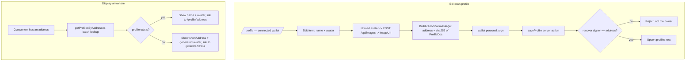

# 009 — User Profiles

> Wallet-owned public profiles (display name + avatar) that let users personalise their identity and have it appear everywhere their address is shown across the app.

## Meta

| Field           | Value                                        |
|-----------------|----------------------------------------------|
| **Status**      | Review                                       |
| **Author**      | Ricardo Vinicius                             |
| **Created**     | 2026-07-09                                   |
| **Updated**     | 2026-07-09                                   |
| **Depends on**  | #008 (reuses the address-owned metadata + signing pattern and the My Tournaments role model) |
| **Supersedes**  | —                                            |

---

## Problem Statement

Today the app identifies every user only by their raw wallet address (`0x1234…abcd`) with a placeholder avatar derived from the first two hex characters. This is impersonal and makes it hard to recognise organizers, opponents, and players across tournaments. Users have no way to present a human-readable identity. This feature lets any wallet claim a lightweight, self-authenticated profile (display name + avatar) that surfaces consistently in participant lists, brackets, and judging screens.

---

## Goals & Non-Goals

### Goals

- [ ] Let a connected wallet create and edit its own profile: a **display name** and an **avatar image**.
- [ ] Authenticate edits with a wallet signature (`personal_sign`) — no gas, no on-chain transaction — following the established `tournamentMetadata` pattern.
- [ ] Serve a **public profile page** at `/profile/[address]` showing the user's public info and the tournaments they have **played** in.
- [ ] Serve the connected user's **own profile** at `/profile` with inline edit controls.
- [ ] Store avatars through the existing `/api/images` upload pipeline.
- [ ] Propagate the resolved name + avatar (with a clickable link to the public profile) everywhere an address is currently rendered: participant list, bracket match cards, and the judge vote page.
- [ ] Provide a consistent fallback (truncated address + deterministic generated avatar) for addresses without a profile.

### Non-Goals

- On-chain storage of profile data (chosen off-chain signed model; see Decision Log).
- Additional profile fields beyond name + avatar (no bio, social links, or banner in this spec).
- Globally unique usernames / handle reservation — display names are **non-unique** labels.
- ENS name or avatar resolution (explicit non-goal).
- Showing organized or judged tournaments on the public profile — history lists **played** tournaments only.
- Following, messaging, reputation scores, or any social graph.
- Profile deletion (a user may edit their profile to blank values but there is no delete flow in this spec).

---

## Proposed Solution

### Overview

Profiles reuse the exact trust model already proven by tournament metadata: an app-owned Postgres table keyed by wallet address, where every write is authenticated by a `personal_sign` signature that the server recovers and compares to the subject address. No smart contract, no gas.



### User Experience

#### Own profile — `/profile` (connected wallet)

1. User clicks **Profile** in the main nav.
2. If the wallet is **not connected**, show a connect-wallet empty state ("Connect your wallet to view and edit your profile" + Connect button).
3. If connected, show the profile in **view mode**: avatar, display name (or truncated address if unset), the wallet address (with copy control), and the played-tournaments list.
4. An **Edit profile** button switches to **edit mode** (inline), revealing:
   - Display name text field (pre-filled).
   - Avatar upload control (drag/drop or file picker; shows current avatar or generated fallback as preview).
   - **Save** and **Cancel** buttons.
5. On **Save**:
   - If a new avatar file was chosen, it is uploaded to `/api/images` first, yielding an `imageUrl`.
   - The client builds the canonical message and requests a wallet signature.
   - The `saveProfile` server action verifies the signature and upserts the row.
   - On success, the form returns to view mode with a success toast; on failure, an inline error is shown and edit mode is preserved.

#### Public profile — `/profile/[address]`

1. Any visitor (connected or not) can open `/profile/[address]`.
2. Shows read-only: avatar, display name (or truncated address), the address (copy control), and the list of tournaments this address has **played** in (name, status, link to the tournament detail page).
3. No edit controls are shown unless the viewed address equals the connected wallet — in that case an **Edit profile** button links to `/profile`.

#### Propagation across the app

Everywhere an address is rendered, a shared `UserIdentity` component resolves it to `{ avatar, name }` and links to `/profile/[address]`:
- **Participants list** (`ParticipantsPanel`) — each roster row.
- **Bracket match cards** (`MatchCard`) — each player slot.
- **Judge vote page** — the two players being judged.
- **Overview panel** — the organizer address ("etc." from the draft).

#### Edge cases and error states

| Scenario | Behaviour |
|----------|-----------|
| Address has no profile | Render `shortAddress` + deterministic generated avatar; still links to `/profile/[address]` (which shows the fallback view + played history) |
| Display name is empty/whitespace on save | Reject with a validation error; a blank name is not persisted |
| Display name exceeds max length | Reject with a validation error stating the max (50 chars) |
| Avatar file too large / wrong type | Handled by the existing `/api/images` validation (2 MB max; PNG/JPEG/WebP only); surface the returned error inline |
| Signature rejected in wallet | Abort save, keep edit mode, show "Signature required to save your profile" |
| Recovered signer ≠ subject address | Server rejects with "Only the address owner may edit this profile" (defence in depth; the client only ever signs for the connected wallet) |
| `/profile/[address]` with a malformed address | Return 404 (invalid address param) |
| Viewing own address at `/profile/[address]` | Read-only view + an "Edit profile" link to `/profile` |
| Wallet on an unsupported chain | Profile editing still works — `personal_sign` is chain-agnostic and profiles are off-chain |
| Address casing | All addresses are normalised to lowercase for storage and lookup; displayed via checksum/`shortAddress` |

### Data Model

New **app-owned** Postgres table, added to `packages/db/src/schema.ts` alongside `tournamentMetadata`. Follows the same JSONB-doc shape.

```ts
// packages/db/src/schema.ts (additions)

/** Off-chain, self-authenticated user profile. The primary key IS the owner:
 *  a write is only accepted when the recovered signer equals `userAddress`. */
export const profiles = pgTable("profiles", {
  // Lowercased wallet address of the profile subject/owner.
  userAddress: text("user_address").primaryKey(),
  metadata: jsonb("metadata").$type<ProfileDoc>().notNull(),
  createdAt: timestamp("created_at", { withTimezone: true }).notNull().defaultNow(),
  updatedAt: timestamp("updated_at", { withTimezone: true }).notNull().defaultNow(),
});

export type ProfileRow = typeof profiles.$inferSelect;
export type NewProfileRow = typeof profiles.$inferInsert;

/** Public, user-editable profile fields (stored as JSONB). Minimal by design. */
export type ProfileDoc = {
  displayName: string;         // 1..50 chars, trimmed, no control characters
  avatarUrl?: string;          // relative `/api/images/:id` only (own-upload)
};
```

Notes:
- Unlike `tournamentMetadata`, there is **no separate `ownerAddress` column** — for a profile the primary key *is* the owner. Ownership is proven by recovering the signature to `userAddress`.
- `displayName` is **not** unique (no unique index). Address remains the true identity.
- `avatarUrl` is restricted to our own `/api/images/:id` relative paths (see Business Rules) — avatars always originate from the existing upload pipeline, so external/absolute URLs are rejected. This is intentionally stricter than `tournamentMetadata.imageUrl`.

### Signing & Server Actions

Profiles reuse the isomorphic canonical-JSON + SHA-256 message-building approach already used for tournament metadata (`features/tournaments/lib/metadataMessage.ts`). To avoid duplication (AGENTS.md: "No code duplication"), the shared primitives `canonicalJson()` and `sha256Hex()` are **extracted** to `apps/web/src/shared/crypto/` and imported by both the tournaments and profiles features.

**Canonical message format** (built by `buildProfileMessage(userAddress, doc)`):

```
Arbiter — save profile
address: <lowercased user address>
hash: <sha-256 hex of canonicalJson(ProfileDoc)>
```

**Server action** `saveProfile`:

```ts
// apps/web/src/features/profiles/actions/saveProfile.ts
"use server";

export type SaveProfileInput = {
  userAddress: string;
  metadata: ProfileDoc;
  signature: `0x${string}`;
};

export type SaveProfileResult = { ok: true } | { ok: false; error: string };

export async function saveProfile(input: SaveProfileInput): Promise<SaveProfileResult>;
```

Implementation:
1. Validate `metadata` with the zod `profileDocSchema` (trims name, enforces length, validates `avatarUrl` shape). Reject on failure with the offending value in the message.
2. Rebuild the canonical message from `userAddress` + validated `metadata`.
3. Recover the signer from `signature` (`recoverProfileSigner`, mirroring `recoverMetadataSigner`).
4. Reject unless `isAddressEqual(signer, userAddress)`.
5. Upsert the `profiles` row (`onConflictDoUpdate` on `userAddress`), bumping `updatedAt`.

**Read helpers** (server, in `features/profiles/server/`):

| Function | Signature | Purpose |
|----------|-----------|---------|
| `getProfile` | `(address: string) => Promise<ProfileRow \| null>` | Single profile for the public/own page |
| `getProfilesByAddresses` | `(addresses: string[]) => Promise<Map<string, ProfileDoc>>` | **Batch** lookup so propagation sites resolve N addresses in one query (avoids N+1) |
| `getPlayedTournaments` | `(address: string) => Promise<PlayedTournament[]>` | Tournaments the address is registered in, from `ponder.registration` joined to `ponder.tournament` + reconciled metadata, newest first |

There are **no REST endpoints** for profile mutation — writes go through the server action, consistent with `saveTournamentMetadata`. The existing `/api/images` routes are reused unchanged for avatar upload/serve.

### Frontend Components

| Component | Path | Description |
|-----------|------|-------------|
| `page.tsx` (own) | `apps/web/src/app/profile/page.tsx` | Route entry for `/profile`; renders `OwnProfilePage` |
| `page.tsx` (public) | `apps/web/src/app/profile/[address]/page.tsx` | Route entry for `/profile/[address]`; validates the address param, renders `PublicProfilePage` |
| `OwnProfilePage` | `features/profiles/components/OwnProfilePage.tsx` | Client component; reads wallet via `useAccount`, toggles view/edit, connect-wallet gate |
| `PublicProfilePage` | `features/profiles/components/PublicProfilePage.tsx` | Read-only profile + played history; "Edit" link when viewed address == connected wallet |
| `ProfileHeader` | `features/profiles/components/ProfileHeader.tsx` | Avatar + display name + address (copy control); shared by own/public views |
| `ProfileEditForm` | `features/profiles/components/ProfileEditForm.tsx` | Name field + avatar upload; orchestrates upload → sign → `saveProfile` |
| `PlayedTournamentsList` | `features/profiles/components/PlayedTournamentsList.tsx` | Renders the played-tournaments cards/list with empty state |
| `UserIdentity` | `features/profiles/components/UserIdentity.tsx` | **Shared propagation primitive** — given `address` + optional resolved `ProfileDoc`, renders avatar + name (or fallback) as a link to `/profile/[address]` |
| `UserAvatar` | `features/profiles/components/UserAvatar.tsx` | Avatar `` when `avatarUrl` set, else deterministic generated avatar from the address |

**Client hook** `useSaveProfile` (`features/profiles/hooks/useSaveProfile.ts`) mirrors `useUpdateTournamentMetadata`: builds the message, calls `signMessageAsync`, invokes the `saveProfile` action, returns pending/error state.

### Business Rules

1. A profile write is accepted only when the recovered signer equals the `userAddress` being written (self-authentication). There is no admin override.
2. Addresses are normalised to **lowercase** for storage and all lookups; display uses checksum / `shortAddress`.
3. `displayName` is required, trimmed, 1–50 characters, and must contain at least one non-whitespace character. It is **not** unique.
4. `avatarUrl`, if present, must match `^/api/images/[0-9a-f-]{36}$` (our own upload). Absolute/external URLs are rejected.
5. Avatars obey the existing image pipeline limits: PNG/JPEG/WebP, ≤ 2 MB, MIME sniffed from magic bytes.
6. The public profile history lists only tournaments where the address appears in `ponder.registration` (played), sorted newest-first by registration time.
7. When no profile exists for an address, every display site falls back to `shortAddress` + a deterministic generated avatar; the link to `/profile/[address]` is still rendered.
8. Rendering user-supplied `displayName` relies on React's default text escaping — it is never injected as HTML.
9. Profile data is public: no field is access-gated. Anyone may read any profile.

---

## Implementation Plan

### Backend

1. `apps/web/src/shared/crypto/` — extract `canonicalJson()` and `sha256Hex()` from `features/tournaments/lib/metadataMessage.ts`; update the tournaments feature to import from the new shared location (no behaviour change).
2. `packages/db/src/schema.ts` — add the `profiles` table, `ProfileRow`/`NewProfileRow`, and the `ProfileDoc` type; export from `packages/db/src/index.ts`.
3. `apps/web/src/features/profiles/schema/profile.ts` — zod `profileDocSchema` (name length/trim, `avatarUrl` regex).
4. `apps/web/src/features/profiles/lib/profileMessage.ts` — `buildProfileMessage()` using the shared crypto helpers.
5. `apps/web/src/features/profiles/server/verifyProfileSigner.ts` — `recoverProfileSigner()` mirroring `recoverMetadataSigner`.
6. `apps/web/src/features/profiles/actions/saveProfile.ts` — the `saveProfile` server action (validate → rebuild message → recover → authorise → upsert).
7. `apps/web/src/features/profiles/server/getProfile.ts`, `getProfilesByAddresses.ts`, `getPlayedTournaments.ts` — read helpers.

### Frontend

1. `features/profiles/components/UserAvatar.tsx` and `UserIdentity.tsx` — the shared display primitives (build these first; propagation depends on them).
2. `features/profiles/hooks/useSaveProfile.ts` — upload/sign/save orchestration hook.
3. `features/profiles/components/ProfileHeader.tsx`, `ProfileEditForm.tsx`, `PlayedTournamentsList.tsx`.
4. `features/profiles/components/OwnProfilePage.tsx` and `PublicProfilePage.tsx`.
5. `apps/web/src/app/profile/page.tsx` and `apps/web/src/app/profile/[address]/page.tsx` — route entries (thin; param validation + render).
6. **Propagation** — replace raw address rendering with `<UserIdentity>` and batch-resolve profiles via `getProfilesByAddresses` in:
   - `features/tournaments/components/details/ParticipantsPanel.tsx`
   - `features/tournaments/components/bracket/MatchCard.tsx` (and its loader in `BracketTree.tsx`)
   - the judge vote page under `app/tournaments/[address]/matches/[matchIndex]/vote`
   - `features/tournaments/components/details/OverviewPanel.tsx` (organizer)
7. Confirm the main-nav "Profile" link points to `/profile` (already present per `MainNav.tsx`).

### Migrations

1. Generate and apply a Drizzle migration for the new `profiles` table (drizzle-kit, via the `@arbiter/db` package scripts). No ponder/indexer changes are required — played history reads existing `ponder.registration`/`ponder.tournament`.

---

## Testing Strategy

### Backend Tests

| Test | Location | Verifies |
|------|----------|----------|
| Signature recovery — happy path | `features/profiles/actions/saveProfile.test.ts` | A valid signature from the subject address upserts the row |
| Rejects foreign signer | same | Signature recovering to a different address is rejected |
| Rejects tampered metadata | same | Metadata changed after signing fails the hash/recovery check |
| Name validation | `features/profiles/schema/profile.test.ts` | Empty/whitespace and > 50-char names rejected; valid trimmed name accepted |
| `avatarUrl` validation | same | `/api/images/<uuid>` accepted; absolute/external URLs rejected |
| Canonical message determinism | `shared/crypto/*.test.ts` + `profileMessage.test.ts` | Same doc → same hash regardless of key order (isomorphic client/server) |
| `getProfilesByAddresses` batch | `features/profiles/server/getProfilesByAddresses.test.ts` | Returns a map keyed by lowercase address; missing addresses absent from the map |
| `getPlayedTournaments` | `features/profiles/server/getPlayedTournaments.test.ts` | Returns played tournaments newest-first with reconciled metadata |

Mock `@arbiter/db` with named fake classes; inject the recover function where needed (mirroring the tournament tests).

### Frontend Tests (optional)

- `UserIdentity` renders name + avatar when a profile is supplied, and `shortAddress` + generated avatar when not — in both cases linking to `/profile/[address]`.
- `ProfileEditForm` blocks submit on an empty name and surfaces the image-upload error.

### Manual Verification

1. Run the app against a local Hardhat node + indexer with at least one tournament and a registered player.
2. Connect wallet A, open `/profile`, set a display name and upload an avatar, sign → confirm the profile persists after reload.
3. Open `/profile/[address-of-A]` in a fresh session (wallet disconnected) → confirm the public view and the played-tournaments list render read-only.
4. Open a tournament A played in → confirm the participants list, bracket card, and judge vote page show A's name + avatar, each linking to `/profile/[address-of-A]`.
5. For an address with no profile, confirm the fallback (truncated address + generated avatar) appears and still links to its public profile.
6. Attempt to edit while on the wrong chain → confirm signing still succeeds (chain-agnostic).
7. Reject the signature prompt → confirm edit mode is preserved and an error is shown.

---

## Open Questions

> All resolved during spec review (see Decision Log). None outstanding.

---

## Decision Log

| Date | Decision | Rationale |
|------|----------|-----------|
| 2026-07-09 | Off-chain, signature-authenticated storage (not on-chain) | Reuses the proven `tournamentMetadata` pattern; no gas, no new contract/indexer; edits are instant. "Chain based" is satisfied by keying to the wallet address and proving control via `personal_sign` |
| 2026-07-09 | Minimal fields: display name + avatar only | Scoped to the draft's core; bio/socials/banner deferred to a future spec |
| 2026-07-09 | Avatars via the existing `/api/images` pipeline; `avatarUrl` restricted to our own paths | Reuses validated upload/serve; rejecting external URLs avoids SSRF/tracking-pixel abuse |
| 2026-07-09 | Public history shows played tournaments only | Matches the chosen scope; organized/judged history is out of scope here (organizer/judge dashboards live in spec 008) |
| 2026-07-09 | Non-unique display names | Address is the true identity; avoids handle reservation, case-folding, and collision complexity |
| 2026-07-09 | `/profile` own (inline edit) + `/profile/[address]` public read-only | Mirrors the `/tournaments/[address]` routing pattern; nav already links to `/profile` |
| 2026-07-09 | No ENS resolution | Limited value on testnets; adds lookup/caching complexity. Fallback is `shortAddress` + generated avatar |
| 2026-07-09 | Names/avatars link to the public profile across the app | Makes profiles discoverable from participant lists, brackets, and judging screens |
| 2026-07-09 | Extract `canonicalJson`/`sha256Hex` to `shared/crypto` | Shared by tournaments and profiles; prevents duplication of the signing primitives |

---

## References

- Spec #008 — My Tournaments (role model, address-owned data, reconciliation pattern).
- `features/tournaments/actions/saveTournamentMetadata.ts`, `lib/metadataMessage.ts`, `server/verifyOwnerSignature.ts` — the signing pattern this spec mirrors.
- `app/api/images/route.ts` + `features/images/` — the avatar upload/serve pipeline.
- `features/tournaments/lib/formatTournament.ts` (`shortAddress`) and existing `AddressAvatar` usage — display conventions being upgraded.
