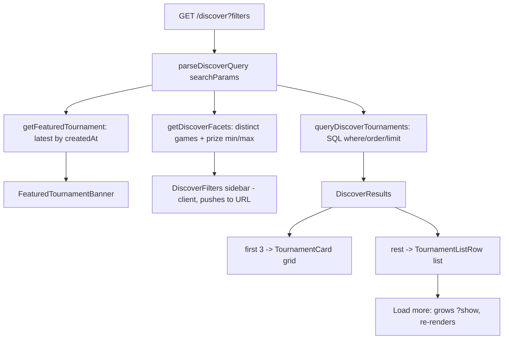

# 010 — Discover Page

> Rebuild `/discover` to match the design: a featured hero for the latest tournament, a lateral filter sidebar, search + sort, and a browse area that renders the first three matches as cards and the rest as a wide list.

## Meta

| Field           | Value                                             |
|-----------------|---------------------------------------------------|
| **Status**      | Review                                            |
| **Author**      | Ricardo Vinicius                                  |
| **Created**     | 2026-07-10                                        |
| **Updated**     | 2026-07-10                                        |
| **Depends on**  | #002 (create UI), #003 (metadata store), #004 (details page) |
| **Supersedes**  | —                                                 |

---

## Problem Statement

The `/discover` page is currently a bare paginated grid of `TournamentCard`s with a heading and a numeric pager. The approved design (screen 3, `docs/design_extracted/.../Tournaments DApp *.dc.html`) calls for a richer browse experience: a **featured hero** promoting the newest tournament, a **filter sidebar** (status, game, prize, format), a **search + sort** bar, and a two-tier result area — the top three matches as **cards** and the remainder as a **wide list**. Without these, users cannot narrow a growing set of on-chain tournaments to the ones they care about, and the page does not reflect the product's visual identity.

---

## Goals & Non-Goals

### Goals

- [ ] Render a **featured hero banner** for the most recently created tournament (badges, name, summary line, prize, Details/Join actions).
- [ ] Render a **filter sidebar**: Status (Registration open / Live / Finished), Game/category, Prize (ETH) range, Format, and "Clear all filters".
- [ ] Render a **search input** (matches tournament name, game, and organizer) and a **sort dropdown**.
- [ ] Render matches as **3 cards** (reusing `TournamentCard`) followed by a **wide list** of the remaining matches, with a **"Load more"** control.
- [ ] Drive all filter/search/sort/paging state through the **URL** (`searchParams`) so the Server Component re-queries and links are shareable and work without client JS.
- [ ] Do all filtering, searching, and sorting **server-side in SQL** (Drizzle), enforcing metadata owner-reconciliation so only trusted metadata is searched.
- [ ] Source the **game options** and **prize range bounds** dynamically from the database.
- [ ] Show an **empty state** when no tournaments match the active filters.

### Non-Goals

- Changing the on-chain contracts, the Ponder indexer schema, or adding any database migration (no new columns/tables).
- Numeric page-number pagination (replaced by "Load more").
- Personalisation or role awareness (that is `#008 My Tournaments`; the discover grid omits role badges as it does today).
- Real-time updates / websockets when new tournaments are indexed.
- The global app shell / top navigation and wallet pill (assumed to exist from prior work).
- Saved filters, filter presets, or URL-shortening.
- Mobile-specific layouts beyond Tailwind responsive utilities.

---

## Proposed Solution

### Overview

The route stays a **dynamic Server Component** (`export const dynamic = "force-dynamic"`). Client interactivity is confined to small "controller" components (`DiscoverFilters`, `DiscoverSearchBar`) that read/write `searchParams` via `useRouter`/`usePathname`/`useSearchParams`; every change navigates, and the server re-queries. No client-side data fetching.

### User Experience

**Layout** (desktop): featured hero spans the top. Below it, a two-column layout — filter sidebar on the left, and on the right the search+sort bar, then the 3-card grid, then the "More tournaments" list, then "Load more". On small screens the sidebar collapses above the results (Tailwind responsive stacking).

**Primary flow**
1. User lands on `/discover`. Hero shows the newest tournament; results show all tournaments (default sort **Starting soon**), first 3 as cards, rest as list.
2. User ticks **Status → Live** in the sidebar. The URL gains `?status=live`; the page re-renders showing only live tournaments. Hero is unaffected (always the latest overall).
3. User types "smash" in search. Debounced, the URL gains `?q=smash`; results filter to tournaments whose name, game, or organizer address matches.
4. User drags the **Prize** slider and picks a **Game**; URL gains `?minPrize=&maxPrize=&game=`; results narrow further.
5. User clicks **Load more**; `?show` grows by a step and more list rows render.
6. User clicks **Clear all filters**; navigates back to `/discover` with no query.

**Featured hero content** (from on-chain row + trusted metadata):
- Badges: `FEATURED` + the status badge (`Registration open` / `LIVE` / `Finished`).
- Title: metadata name, else short address.
- Summary line: `{maxPlayers} players · {format} · {relative date} · by {shortAddress(organizer)}`.
- `Prize {ethLabel(prize)}`.
- Actions: **Details** (link to `/tournaments/:address`) and, when registration is open, **Join** (link to the register route).

**Edge cases / error states**
- **No tournaments at all**: hero is omitted; results show the existing empty state ("No tournaments yet.").
- **No matches for active filters**: hero still renders (latest overall); results show a distinct empty state ("No tournaments match your filters.") with a "Clear all filters" action.
- **Fewer than 3 matches**: render only that many cards; no list, no "Load more".
- **Featured is the only tournament**: it appears in the hero and is excluded from the results, so results show the "no matches"/empty state as appropriate.
- **Untrusted metadata** (owner mismatch): treated as absent — the card falls back to on-chain-only facts and is not matched by name/game search.

### Data Model

**No schema changes and no migration.** The feature reads the existing on-chain mirror `tournament` (`@arbiter/db`) left-joined with `tournament_metadata`, exactly as `listTournamentsWithMetadata` does today. Filtering adds SQL `WHERE`/`ORDER BY` clauses over existing columns and the metadata `jsonb`.

Filterable sources:

| Facet | Source | SQL strategy |
|-------|--------|--------------|
| Status | derived from `start_date` / `end_date` vs `now()` | date comparisons (see Business Rules) |
| Prize range | `tournament.prize` (bigint wei) | `prize BETWEEN :minWei AND :maxWei` |
| Format | `tournament.format` (int enum) | `format IN (:values)` |
| Game / category | `metadata->>'game'` / `metadata->>'category'` (trusted only) | `jsonb ->>` equality |
| Search `q` | `organizer` column + `metadata->>'name'` / `->>'game'` (trusted only) | `ILIKE '%q%'` across the three |
| Sort | `created_at`, `start_date`, `prize` | `ORDER BY` |

**Metadata trust in SQL.** Today `reconcile()` drops metadata whose `ownerAddress` differs from the on-chain `organizer` in the app layer. Because we now filter/search on metadata columns, the join condition must additionally require `lower(tournament_metadata.owner_address) = lower(tournament.organizer)`. Untrusted metadata then joins as `NULL`, so it neither leaks into search nor is displayed — preserving the guarantee in `reconcileMetadata.ts`.

### URL / Query Contract

Parsed by a Zod schema into a typed `DiscoverQuery`. All params optional.

| Param | Type | Values / notes |
|-------|------|----------------|
| `q` | string | Free text; trimmed; empty = no search. |
| `status` | repeatable/CSV | `open` (Registration open = "soon"), `live`, `finished`. Multiple = OR. |
| `game` | string | Exact match against trusted `metadata->>'game'` (or `category`). |
| `format` | repeatable/CSV | Format enum index(es) from `TOURNAMENT_FORMATS`. Multiple = OR. |
| `minPrize` | number (ETH) | Lower bound; parsed to wei. Clamped to facet min. |
| `maxPrize` | number (ETH) | Upper bound; parsed to wei. Clamped to facet max. |
| `sort` | enum | `soon` (default), `newest`, `prize_desc`, `prize_asc`. |
| `show` | int | Number of **list** rows to render (cards are always 3). Default `LIST_STEP`; "Load more" adds `LIST_STEP`. Clamped `[LIST_STEP, MAX_SHOW]`. |

> Note: the design's "Upcoming" status is intentionally not a separate value — under the derived model (`tournamentStatus.ts`) registration is open exactly while a tournament is "soon", so "Registration open" and "Upcoming" are the same state. The sidebar shows three status checkboxes: **Registration open**, **Live**, **Finished**.

### Server Functions

| Function | Path | Responsibility |
|----------|------|----------------|
| `parseDiscoverQuery(searchParams)` | `features/discover/schema/discoverQuery.ts` | Zod-parse raw `searchParams` into a typed `DiscoverQuery` (defaults, clamping, CSV/array coercion). |
| `queryDiscoverTournaments(query, opts)` | `features/discover/server/queryDiscoverTournaments.ts` | Build Drizzle `where`/`orderBy` from `DiscoverQuery`; return `{ items, total }` excluding the featured address. Reuses `reconcile()` for the returned rows. |
| `getFeaturedTournament()` | `features/discover/server/getFeaturedTournament.ts` | Latest tournament by `createdAt desc, index desc`, limit 1, with reconciled metadata. Ignores filters. |
| `getDiscoverFacets()` | `features/discover/server/getDiscoverFacets.ts` | Distinct trusted `game` values and `{ minPrizeWei, maxPrizeWei }` across all tournaments, for the sidebar controls. |

`queryDiscoverTournaments` fetches the first `CARDS_COUNT + query.show + 1` rows (the `+1` tells the UI whether a "Load more" is available) plus a `count()` for the empty-vs-no-match distinction.

### Frontend Components

| Component | Path | Description |
|-----------|------|-------------|
| `DiscoverPage` (route) | `app/discover/page.tsx` | Route entry only: awaits `searchParams`, calls the four server fns, composes the sections. No business logic. |
| `FeaturedTournamentBanner` | `features/discover/components/FeaturedTournamentBanner.tsx` | Server component; renders the hero from a `TournamentListItem`. |
| `DiscoverFilters` | `features/discover/components/DiscoverFilters.tsx` | **Client**; status checkboxes, game `Select`, prize `Slider`, format checkboxes, "Clear all". Reads/writes `searchParams`. |
| `DiscoverSearchBar` | `features/discover/components/DiscoverSearchBar.tsx` | **Client**; debounced search `Input` + sort `Select`; writes `searchParams`. |
| `DiscoverResults` | `features/discover/components/DiscoverResults.tsx` | Server component; splits items into first-3 cards + list rows; renders empty states and the "Load more" link. |
| `TournamentListRow` | `features/discover/components/TournamentListRow.tsx` | Wide list row: name, `{players} · {format} · by {org}`, status badge, prize, action button. |
| `TournamentCard` (reuse) | `features/tournaments/components/TournamentCard.tsx` | Unchanged; used for the 3-card grid (no `roles`). |
| `Slider` (new primitive) | `components/ui/slider.tsx` | shadcn `slider` (Radix), added via the shadcn CLI — not currently present. |

Client controllers update the URL with a shared helper (e.g. `setParams(next)`) using `useRouter().replace` + `useSearchParams`, preserving unrelated params and resetting `show` when filters change. Search is debounced (~300 ms).

### Business Rules

1. **Featured selection**: newest by `createdAt` (tie-break `index`), regardless of active filters. Always excluded from the results query by address so it never appears twice.
2. **Status derivation** (must match `deriveTournamentStatus`): `open` = `now < start_date`; `live` = `start_date <= now <= end_date`; `finished` = `now > end_date`. Implemented in SQL with `now()`; multiple selected statuses OR together. The "Join" action shows only when status is `open`.
3. **Metadata trust**: metadata participates in display/search/filter only when `lower(owner_address) = lower(organizer)`. Enforced in the join condition; `reconcile()` remains the app-layer guard for returned rows.
4. **Prize bounds**: `minPrize`/`maxPrize` are ETH decimals converted with `parseEther`; clamp to the facet min/max; ignore an inverted range (min > max) by swapping.
5. **Search** matches (case-insensitive) trusted `metadata.name`, trusted `metadata.game`, and the `organizer` address substring.
6. **Result split**: always up to `CARDS_COUNT = 3` cards; the remaining matches render as list rows up to `show`. "Load more" renders only when more matches exist beyond `show`.
7. **Sort**: `soon` -> `start_date asc`; `newest` -> `created_at desc`; `prize_desc` -> `prize desc`; `prize_asc` -> `prize asc`. Stable tie-break on `index desc`.
8. **No raw non-ASCII** in literals/JSX text — reuse `shortAddress`, `ethLabel`, `formatLabel` and `…`/`·` escapes (AGENTS.md).

---

## Implementation Plan

### Server

1. `features/discover/schema/discoverQuery.ts` — Zod schema + `parseDiscoverQuery`; export `DiscoverQuery`, constants `CARDS_COUNT`, `LIST_STEP`, `MAX_SHOW`, and the `sort`/`status` enums.
2. `features/discover/server/queryDiscoverTournaments.ts` — extend the pattern in `listTournaments.ts`: shared `select`+left-join with the added owner-match join condition; compose `and(...)` of the status/prize/format/game/search predicates; `orderBy` from `sort`; `limit`/`offset`; map with `reconcile()`; return `{ items, total }` and exclude the featured address.
3. `features/discover/server/getFeaturedTournament.ts` — single-row latest query with reconciled metadata (nullable).
4. `features/discover/server/getDiscoverFacets.ts` — `selectDistinct` trusted games + `min/max(prize)`.
5. Unit-test each server helper with a fake DB (named fake, per AGENTS.md), mirroring `listTournaments.test.ts`.

### Frontend

1. Add the shadcn **slider** primitive: `pnpm --filter @arbiter/web dlx shadcn@latest add slider` (verify version/API against installed shadcn before use).
2. `FeaturedTournamentBanner.tsx`, `TournamentListRow.tsx` — presentational; reuse `formatTournament` + `tournamentStatus` helpers.
3. `DiscoverFilters.tsx`, `DiscoverSearchBar.tsx` — client controllers with the shared `setParams` URL helper (debounced search).
4. `DiscoverResults.tsx` — split + empty states + "Load more" link (`?show` + `LIST_STEP`).
5. Rewrite `app/discover/page.tsx` to parse the query, call the four server fns, and compose the sections. Keep `export const dynamic = "force-dynamic"`.
6. Remove/replace the now-unused numeric-pagination path from the discover route (keep `TournamentList`/`Pagination` if still used elsewhere).

### Migrations

None. No schema or contract changes.

---

## Testing Strategy

### Backend / Server Tests
- `parseDiscoverQuery`: defaults, CSV vs array params, clamping of `show`/prize, invalid values ignored.
- `queryDiscoverTournaments`: predicate composition for each facet; status date logic at boundaries (`now == start`, `now == end`); owner-mismatch metadata excluded from search results; featured address excluded; sort ordering.
- `getFeaturedTournament`: returns latest; null metadata when untrusted/absent; null when zero tournaments.
- `getDiscoverFacets`: distinct games (trusted only); prize min/max; empty-DB behaviour.

### Frontend Tests (optional)
- `DiscoverResults`: 0 / 1-3 / >3 items -> correct card/list split, empty-state variants, "Load more" visibility.
- `DiscoverFilters` / `DiscoverSearchBar`: a filter change writes the expected `searchParams` and resets `show`.

### Manual Verification
1. Seed several tournaments (varied dates/prizes/formats; some with trusted metadata, one with mismatched owner).
2. `pnpm build` then run the web app; open `/discover`.
3. Confirm hero = newest; toggle each status/game/format/prize filter and the search box; verify URL updates and results narrow correctly and are shareable (reload the URL).
4. Verify the 3-card + list split, "Load more", the two empty states, and that mismatched-metadata tournaments show on-chain-only and are not found by name search.

---

## Decision Log

| Date | Decision | Rationale |
|------|----------|-----------|
| 2026-07-10 | Server-side, URL-driven filtering/search/sort | Matches the existing `force-dynamic` + `searchParams` pattern; shareable URLs; works without client JS. |
| 2026-07-10 | Collapse the design's 4 status filters to 3 (`open`/`live`/`finished`) | Under `deriveTournamentStatus`, "Registration open" and "Upcoming" are the same "soon" state; a 4th filter would be redundant with no data to distinguish it. |
| 2026-07-10 | Featured = latest overall, ignores filters, excluded from results | Hero is a stable promotional slot; excluding it from the grid avoids duplication. |
| 2026-07-10 | "Load more" via a growing `?show` param (SSR re-render) | Consistent with URL-driven state; no client fetching. |
| 2026-07-10 | Game options + prize bounds sourced dynamically from DB | Always accurate; avoids config drift. |
| 2026-07-10 | Sort options: Starting soon (default), Newest, Prize high/low | Confirmed with author; covers the design's "Starting soon" default plus prize/recency. |
| 2026-07-10 | Enforce metadata owner-match in the SQL join | Filtering/searching on metadata columns must not expose untrusted metadata; preserves `reconcileMetadata` guarantees. |

---

## Open Questions

> None outstanding — resolved in the Decision Log above.

---

## References

- Design: `docs/design_extracted/prot-tipos-dapp-torneios-web3/project/` (screen "3 · Discover"), screenshot `.../screenshots/discover.png`.
- Base spec: `docs/specs/000_base_spec.md`.
- Related: `#008 My Tournaments` (`TournamentCard`/list patterns), `#004 Tournament Details` (status badges), `#003 Metadata Store` (`reconcileMetadata`).
- Code touchpoints: `apps/web/src/app/discover/page.tsx`, `apps/web/src/features/tournaments/server/listTournaments.ts`, `.../server/reconcileMetadata.ts`, `.../lib/{tournamentStatus,formatTournament}.ts`, `packages/db/src/schema.ts`, `apps/indexer/ponder.schema.ts`.